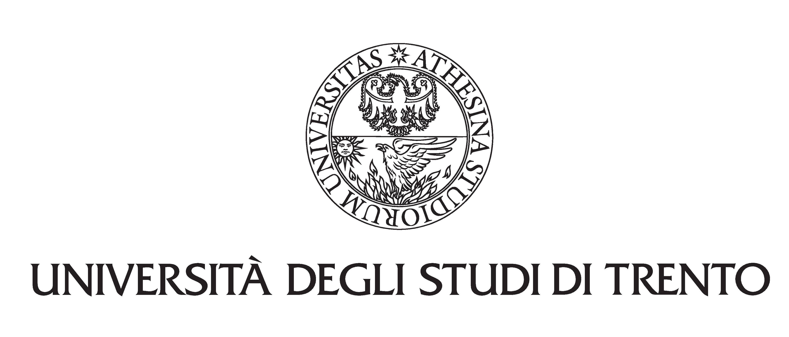

# Appunti di Linguaggi Formali e Compilatori

## Indice
  - [Il progetto](#il-progetto)
  - [Segnalazione errori](#segnalazione-errori)
  - [How to build](#how-to-build)
    - [Standard build chain](#standard-build-chain)
    - [How to build with Docker](#how-to-build-with-docker)
  - [Principali pacchetti impiegati](#principali-pacchetti-impiegati)
  - [La squadra](#la-squadra)

## Il progetto
Questo testo è una dispensa di appunti scritta da studenti; lo scopo è quello di raccogliere i contenuti del corso di Linugaggi Formali e Compilatori e organizzarli secondo un'esposizione quanto più completa, efficace ed intuitiva possibile, tanto per lo studente desideroso di ottenere un'ottima padronanza degli argomenti, quanto anche per lo studente pigro in cerca di risorse per "portare a casa" l'esame.

Gli appunti sono stati presi durante il corso di Linguaggi Formali e Compilatori tenuto dalla professoressa Paola Quaglia per il Corso di Laurea in Informatica, DISI, Università degli studi di Trento, anno accademico 2020-2021. I contenuti provengono quindi primariamente dalle lezioni della professoressa, mentre invece ordine ed esposizione sono in gran parte originali. Allo stesso modo, la maggior parte degli assets (figure, grafi, tabelle, pseudocodici) sono contenutisticamente tratti dal materiale della professoressa, ma ricreati e molto spesso manipolati dagli autori; inoltre, per ottenere il risultato appena citato, è stato molto spesso necessario abbandonare quasi del tutto l'esposizione della professoressa e usarla, appunto, come canovaccio per svilupparne una originale.

Maggiori informazioni sul progetto e e sugli autori possono essere trovate nella prefazione dell'elaborato.

## Segnalazione errori
Se durante la lettura doveste incorrere in errori di qualsiasi tipo, tra gli altri errori di battitura, errori concettuali o di impaginazione, vi chiediamo di fare una segnalazione; ve ne saremo riconoscenti e provvederemo a correggere quanto prima. Se siete arrivati a questo punto assumiamo una buona familiarità con Github, per cui come canali per segnalare errori:
- aprire una Github issue, se possibile referenziando all'interno del corpo anche la porzione di codice in cui è presente l'errore
- se volete direttamente proporre un vostro fix, potete clonare la repo (istruzioni per la build [qui](#how-to-build)) e aprire una pull request con i commit che risolvono l'errore, vi daremo un riscontro quanto prima

Se preferite non segnalare l'errore tramite Github potete comunque contattarci personalmente tramite gli indirizzi email che trovate [sui nostri profili Github](#la-squadra), oppure con la mail istituzionale `nome.cognome@studenti.unitn.it`, o naturalmente con mezzi più informali. 

## How to build
### Standard build chain
Prerequisiti:

- una distribuzione TeX, ad esempio [MiKTeX](https://miktex.org/) o [TeXLive](http://tug.org/texlive/)
- `pip`, per cui assicuratevi di aver installato [Python](https://www.python.org/)
- se volete compilare utilizzando il tool [Arara](https://gitlab.com/islandoftex/arara/), allora dovrete avere una [JVM](https://www.java.com/) installata

A questo punto:

1. clonate la repository con `git clone https://github.com/filippodaniotti/Appunti-LFC`
2. installate il pacchetto Pygments con `pip install Pygments`
3. compilate, ad esempio:
   - lanciando tre volte `pdflatex -shell-escape main.tex`
   - lanciando `latexmk -pdf -shell-escape main.tex`
   - per una compilazione rapida, potete utilizzare Arara con `arara main.tex` (dovete necessariamente trovarvi nella directory `~/src/`), sarà equivalente a lanciare una sola passata di `pdflatex`

È possibile compilare singolarmente ogni capitolo e ogni asset, è sufficiente lanciare la compilazione sul singolo `.tex` desiderato.

Se lavorate con degli IDE o con degli editor in coppia con dei tool per la scrittura LaTeX (e.g. [VS Code](https://code.visualstudio.com) + [LaTeX Workshop](https://marketplace.visualstudio.com/items?itemName=James-Yu.latex-workshop) o [Atom](https://atom.io) + [latex](https://atom.io/packages/latex)), assicuratevi di attivare il flag `-shell-escape` dalle impostazioni di compilazione del vostro tool.

### How to build with Docker
Se non disponete dei prerequisiti per la build indicati sopra (o non volete installarli system-wide), potete
buildare con docker.  
Se poi avete sia [VS Code](https://code.visualstudio.com) che [Docker](https://www.docker.com/), potete riferirvi a questo [gist](https://gist.github.com/civts/234f4e7be7d13df676937996f4d4f45c) per una configurazione già pronta.

Prerequisiti:

- [Docker](https://www.docker.com/)
- almeno 5/6 GB liberi su disco

Procedimento:

1. clonate la repository con `git clone https://github.com/filippodaniotti/Appunti-LFC`
2. se non siete su linux, buildate l'immagine docker contenuta nel Dockerfile con `docker build -t dispensa_lfc .`  
   Nel caso siate su linux, usate questo comando per buildare `docker build -t dispensa_lfc --build-arg UID=$(id -u) --build-arg GID=$(id -g) .` (si assicura che il vostro userId e groupId corrispondano a quelli che il container userà)
3. avviate un container, ricordandovi di montare la cartella della dispensa/
Esempio: `docker run -ti --rm -v $(pwd):/dispensa --name dispensa_lfc dispensa_lfc`
4. ora avete accesso ad un ambiente con tutte le dipendenze installate e potete buildare usando i comandi della sezione [how to build](#How-to-build) (ad eccezione di Arara, perché il container non ha una JVM installata)

## Principali pacchetti impiegati
- `standalone` per gestire la compilazione autonoma di capitoli e assets
- `tabularx` per la gestione delle tabelle
- `forest` per la generazione degli alberi
- `tikz` con librerie `automata` per la generazione dei grafi
- `algorithm2e` per la scrittura degli pseudocodici
- `minted` per la scrittura di codice

## La squadra
- Curatori
  - [Filippo Daniotti](https://github.com/filippodaniotti)
  - [Samuele Conti](https://github.com/samaretas)
- Scrittori
  - [Simone Alghisi](https://github.com/Simone-Alghisi)
  - [Emanuele Beozzo](https://github.com/emanuelebeozzo)
  - [Samuele Bortolotti](https://github.com/samuelebortolotti)
- Tecnici
  - [Francesco Bozzo](https://github.com/FrancescoBozzo)
  - [Federico Izzo](https://github.com/fedeizzo)
- Revisori
  - [Michele Yin](https://github.com/BigEmperor26)
  - [Giacomo Zanolli](https://github.com/civts)
