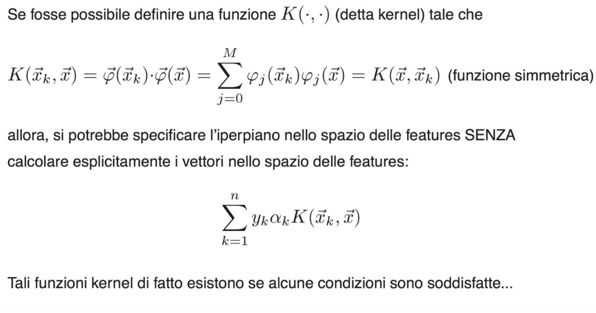

#Lezione 14 - Funzioni Kernel 

In pratica la funzione Kernel serve per calcolare un prodotto scalare in uno spazio a più dimensioni.

##Rappresentazione dei dati con i Kernel

Le funzioni Kernel permettono di andare a definire una serie di metodi per l'apprendimento supervisionato.

Ad esempio data una serie di oggetti *S = {x1,x2,.., xn}* può essere rappresentata con i Kernel come una funzione

> *k*: X *x* X -> R

Cioè una funzione che confronta le varie coppie della serie e le valuta utilizzando un numero reale.

Il dataset *S* può essere quindi rappresentato con una matrice simmetrica *Ki,j = k(xi,xj)*. Inoltre, dal momento che la funzione *k* rappresenta un prodotto scalare su un certo spazio, la matrice *k* è semi-definita positiva (questa realzione vale in se e solo se).

** aggiungi immagine cone definzione di matrice definita semi positva**

###Vantaggi di questa rappresentazione

La rappresentazione dei dati con matrici kernel ha come vantaggi:

- lo stesso algortimo può essere utilizzato per analizzare dati diveri, quindi tutti gli algoritmi **kernel based** saranno definiti sulla forma della matrice.
- la progettazione dei kernel e degli algortimi è modulare
- risulta più semplice integrare viste diverse di oggetti, non sempre esiste una rappresentazione ottimale dello stesso oggetto, diventa quindi possibile combinare tra loro queste rappresentazioni.
- La dimensionalità dei dati dipente solo dal numero di oggetti e non dalla loro dimensione vettoriale.
- La comparazione tra oggetti può risultare più semplice rispetto ad una loro esplicita rappresentazione.

###Metodi Kernel

Molti metodi kernel, comprese le SVM possono essere interpretati come algortimi che, dato un insieme di oggetti *S* risolvono un problema di minimo di una certa funzione *L* associata al rischio empirico.

**immagine 1**

###Modularità dei metodi Kernel

I metodi Kernel possono essere rappresentatni da 5 fasi modulari

1. *n*-oggetti
2. definizione della funzione kernel
3. costruzione della matrice *K*
4. applicazione dell'algoritmo su *K* e *Y* (valori target attesi) (ad esempio SVM)
5. produzione dalla funzione

**sostituire con l'immagine**

##Kernel Trick

Ogni algoritmo per i dati vettoriali che può essere espresso in termini del prodotto scalre tra vettori può essere implicitamente eseguito nello spazio delle feature associatio ad un determinato kernel, rimpiazzando i prodotti scalari con valutazioni kernel.

1. Kerneliizzazione di metodi lineari o basati su distenze, come il Perceptron e K-NN.
2. Applicazione di algoritmi definiti su vettori a dati non vettoriali, utilizzando dei kernel definiti per dati non vettoriali.

Ad esempio K-NN può utilizzare i kernel per calcolare la distanza tra due vettori.

##Tipologie di Kernel

Per **vettori** si possono utilizzare come kernel:

- **lineare**: *k(x,z) = x \* z*
- **polinomiale**: _k(x,z) = (x * z + c)d_
- **gaussiano** (RBF): _k(x,z) = exp(-𝜸||x-z||2)_, ha la caratteristica di essere sempre compreso tra 0 e 1.

Il fatto che il kernel sia sempre maggiore di 0, implica che i due vettori sono nello stesso ottante (tra i due vettori c'è un angolo minore di 90°).

Se *k(x,x)* è uguale a 1 si dice che il kernel è **normalizzato**, ovvero tutti i vettori del feature space sono normalizzati. La matrice kernel definita con un kernel normalizzato ha tutti 1 nella diagonale.

È sempre possibile normalizzare un kernel *k(x,z)* dividendolo per la radice quandrata di _k(x,x) * k(z,z)_

Come kernel per le **stringhe** si possono contare tutte le sequenze di una cerca lunghezza e costruire un vettore delle feature delle occorrenze, questo si fa con le tecniche di programmazione dinamica.

Per gli alberi si possono utilizzare delle tecniche analoghe, considerando i sotto alberi in comune.

C'è un libro **Kernel Methods for Pattern Analysis** che spiega molto bene questa tecnica.

##Operazioni sui Kernel

Una combinazione lineare positiva di kernel è anchessa un kernel, quindi

> k(x,z) = ak1(x,z) + bk2(x,z)

Se quna sequenza di kernel converge puntualmente ad una funzione *f*, allora anche *f* è un kernel.

Ma c'è di più, i kernel possono essere tra loro composti per ottenere altri kernel.

Tutto questo si può andare a combinare per ottenere un kernel migliore.
Dato un insieme *S* di kernel si può definire

> k(x,z) = Sommatoria[S=1,Q]μsks(x,z)

Dove μ è un vettore tale che la loro sommatoria sia 1.

L'idea del Multiple Kernel Learning è di definire degli algoritmi per apprendere i valori di μs della combinazione che migliorino le prestazione di una SVM usando il kernel combinato, rispetto alle SVM ottenute utilizzando i kernel individuali.

