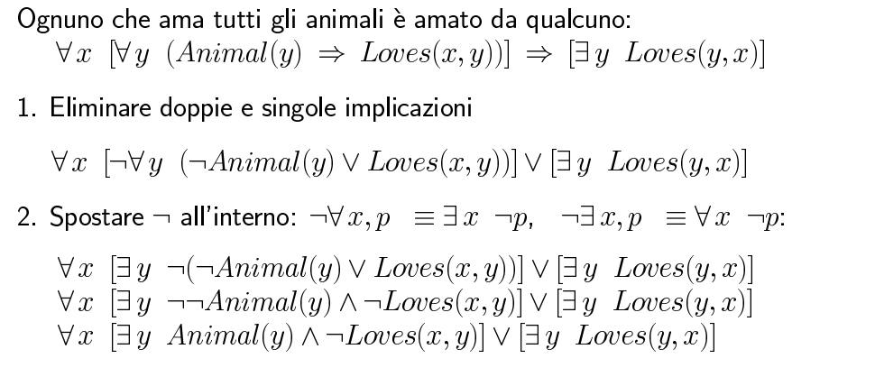
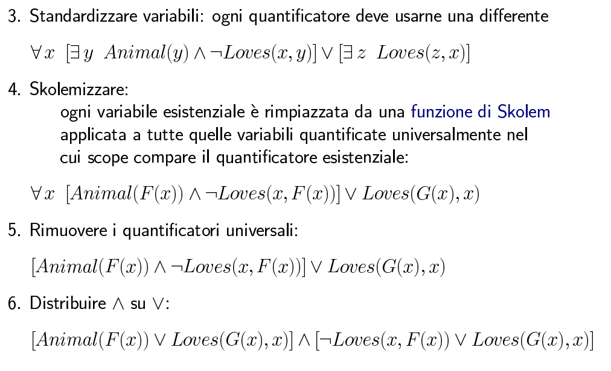
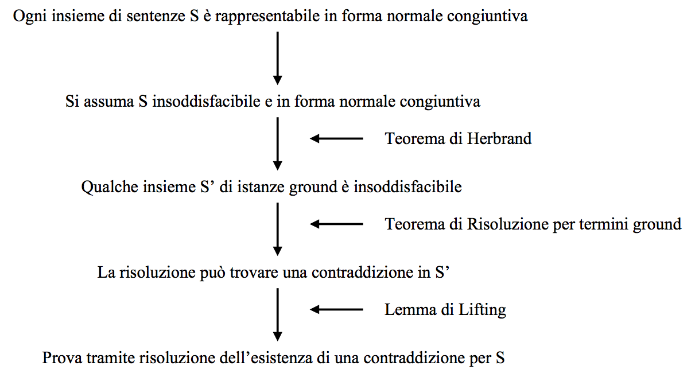
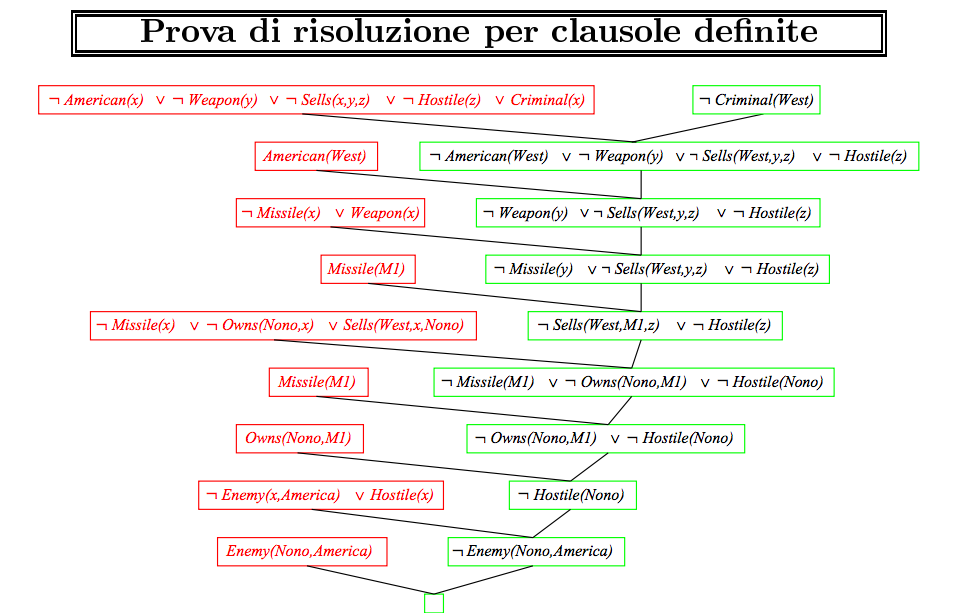

#Lezione 18 - Risoluzione in FOL

Anche in FOL è possibile applicare la regola di risoluzione, con la differenza che vengono ridotti due predicati, che una volta unificati sono tra loro complementari.

##Conversione a CNF

Per poter applicare la risoluzione è necessario che la base di conoscenza sia in CNF.

Per passare alla CNF:

1. Eliminare le implicazioni.
2. Spostare la negazione all'interno, tenendo conto dei vari quantificatori che possono essere negati.
3. Standardizzare le variabili.
4. **Skolemizzare**: ogni variabile esistenziale viene sostituita con una costante di Skolem. Se la variabile esistenziale è all'interno di un quantifiatore esistenzale è necessario utilizzare una **funzione di Skolem**, che va a sostituire tutte le variabili esistenziali che sono all'interno di un qunatificatore universale.
5. Rimuovere i quantificatori universali.
6. Distribuire ⋀ su ⋁.

Se un quantificatore esistenziale si trovata all'interno di due quantificatori esistenziali *∀x,q*, le funzioni di Skolem devono ricevere due parametri *F(x,q)*.

L'algoritmo di inferenza rimane sempre lo stesso, per provare KB|=𝜶, si cerca di provare KB⋁!𝜶, se viene generata la clausola vuota, allora KB|=𝜶.

##Completezza della Risoluzione

Non vediamo la dimostrazione completa.

La dimostrazione parte dal fatto che se l'insieme delle clasule *S*, espresse in FOL, è indosddisfacibile, per il teorema di Herbrand, esiste un sotto-insieme di clausole proposizionalizzate che è insoddisfacibile.

Dal momento che questo sotto-insieme è espresso nella logica proposizionale, si può utilizzare il **ground resolution theorem**: *se un insieme di clausole S è insoddisfacibile, allora la chiusura della risoluzione di tali clausole RC(S) contiene la clausola vuota*, così facendo si effettua la risoluzione del sottoinsieme di clausole per provare l'insoddisfacibilità.

Infine, per lemma di lifting, secondo il quale ad ogni prova per risoluzione nella logica proposizionale corrisopone una prova per risoluzione in FOL che utilizza le stesse sentenze, si si arriva alla prova per contrattizione dell'insoddisfacibilità.

##Esempio di risoluzione

##Strategie di appplicazione della regola di risoluzione

Nella logica proposizionale si può puntare a raggiungere un punto fisso per provare a generare la clausola vuota, tuttavia applicare questa strategia nella logica del primo ordine porta ad un'esplosione combinatoria.

Con il tempo sono state quindi sviluppate varie strategie di risoluzione:

- **Unit clause**: si *preferisce* effettuare la risoluzione con una delle sentenze costituite da un singolo letterale, in modo da avere diminuire la dimensione delle clausola risolvente. Questa strategia è **completa** perché preferisce la clausola unitaria, se non è possibile si continua in modo normale.
- **Unit Resolution**: si esegue la risoluzione coinvolgendo **sempre** una clausola unitaria (**incompleta** in generale, ma completa per le clausole di Horn).
- **Set of support**: utilizza un set di supporto dal quale vengono prelevate le sentenze e dove venogno posti i vari risolventi. Inizialmente il set di supporto è composto dal goal (!𝜶). L'idea è quella di effettuare delle risoluzioni che sono utili per arrivare alla clausola vuota. **Completo** perché vengono fatte solamente delle scelte che portano alla risoluzione.
- **Input resolution**: combina sempre una sentenza di input (KB e Query) con il risolvente corrente. **incompleta** in generale, ma completa per le base di conoscenza in forma di Horn.
- **Linear resolution**: come l'input resolution ma ammette anche la combinazione del risolvente con uno dei suoi avi, ottenendo così una strategia **completa**.
- **Subsumption**: elimina tutte le sentenze che sono *subsumed* (più specifiche di altre), in modo da diminuire il numero di clausole da gestire. Es: se ho sia *P(A)* che *P(x)*, posso rimuovere la clausola *P(A)*.

In ogni caso se la KB contiene una funzione e non implica 𝜶, allora l'algoritmo non termina. 

##Uguaglianza

Nessuno dei tre metodi di fare inferenza visti finora riesce a gestire le asserzioni del tipo *x=y*.
Per gestire questa situzione è possibile utilizzare tre approcci distinti:

1. **Assiomatizzazione**: si aggiungono degli assiomi che descrivono le proprietà dell'uguaglianza (simmetria, transitività, ecc.) ed assiomi opportuni per ogni predicato e funzione. Questa è la stategia più corretta a livello logico, però dal punto di vista computazinale è poco pratico.
2. **Demodulation** o **Paramodulation**: se *x=y* e *Unify(x,z) = 𝝝* allora rimpiazzo *z* con *SUBST(𝝝,y)*.
3. **Estensione** dell'algoritmo di unificazione: i termini equivalenti vengono unificati in un unico termine.

##Riassunto

- La proposizionalizzazione e l'uso dell'unficazione permetteno di evitare l'istanziazione delle variabili coinvolte in una prova.
- Il modus ponens generalizzato usa l'unificazione e permette l'applicazione di forward e backward chaining su clausole definite.
- GMP è completo per le clausole definite, per dei Datalog il problema è sempre decidibile.
- Forward Chaining è completo e polinomiale per i Datalog, però effettua inferenze in modo indiscriminato.
- Backward Chaining è utilizzato in Programmazione Logica e viene "rinforzato" con delle opportune tecniche di compilazione.
- La risoluzione generalizzata è completa per le KB in CNF. Se si usa il principio di induzione non è più completa.
