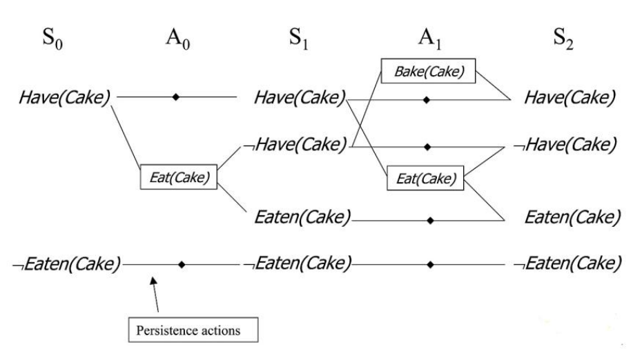
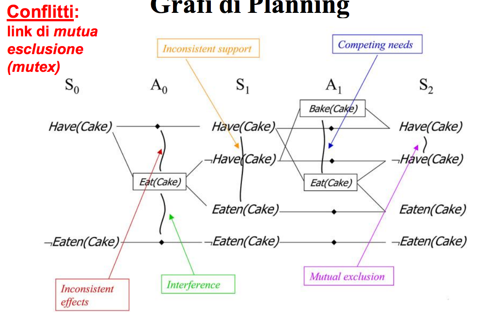
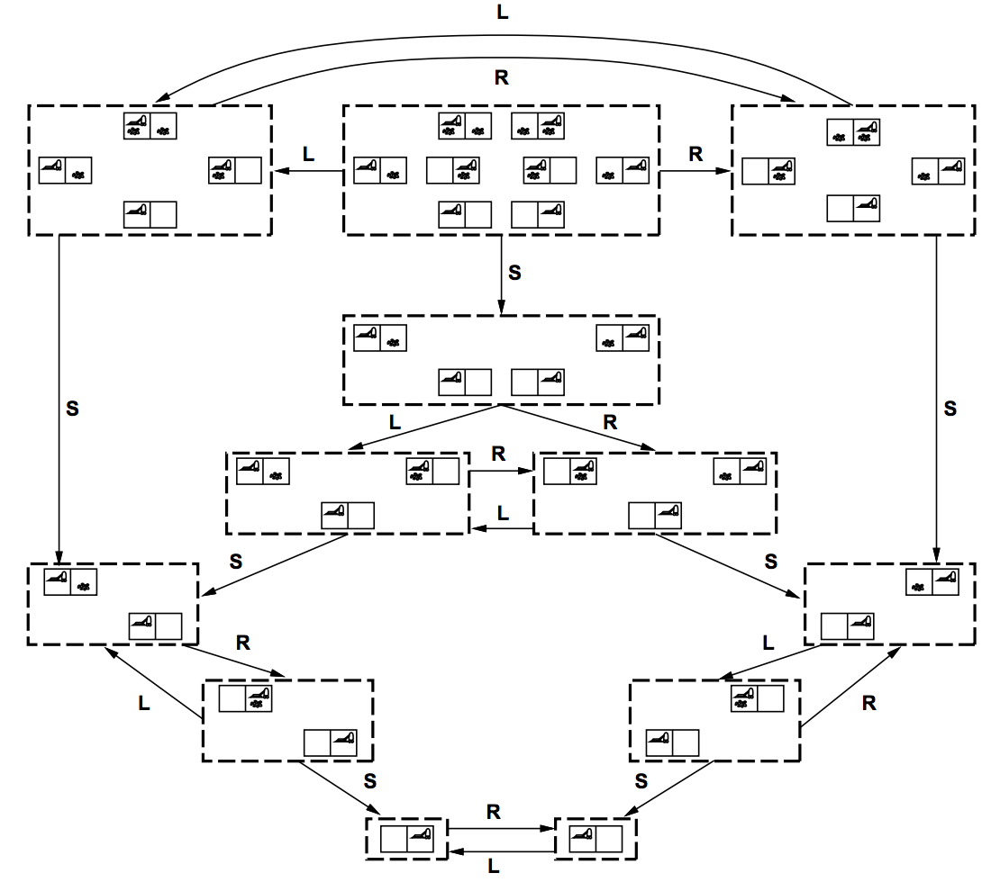
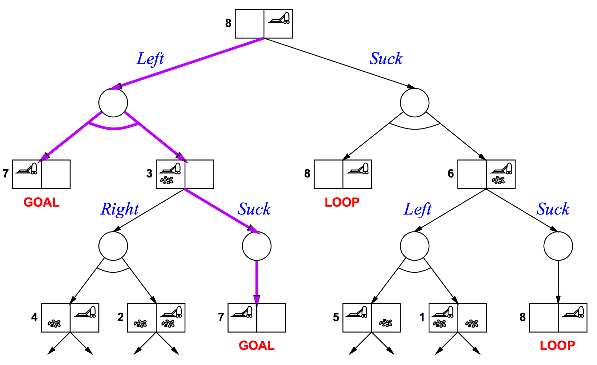

#Lezione 22 - Grafi di planning

##Costruzione di un grafo

Un grafo viene costriuto a livelli:

- Il primo livello contiene tutti i letterali dello stato iniziale
- I successivi livelli sono ottenuti dalla applicazione riperuta delle azioni che hanno i prerequisiti soddisfatti
- I letterali di un livello sono riportati al livello successivo (**persistance actions**)

Il procedimento termina quando non è più possibile aggiungere nuovi letterali.

Per ottenere un risultato in modo efficiente non vengono considerate le variabili e non devono esserci troppi oggetti. Un'altra ipotesi semplificativa è che le azioni non consumano i letterali.

### Esempio della torta

**Stato iniziale**: Have(Cake)

**Goal**: Have(Cake) ⋀ Eaten(Cake)

**Actions**:

- *Eat(Cake)*: PRE: Have(Cake), POST: ¬Have(Cake) ⋀ Eaten(Cake)
- *Bake(Cake)*: PRE: ¬Have(Cake), POST: Have(Cake)



Da notare che in S<sub>1</sub> compaiono contemporaneamente sia *Have(Cake)* che *¬Have(Cake)* e questo è permesso perché stiamo risolvendo un problema rilassato.

L'espasione del grafico termina quando il livello *i+1* coincide con il livello *i*.

Da notare che se nei vari livelli non compaiono mai i goal, questi non possono essere raggiunti nel problema rilassato e di conseguenza non sono raggiungibili neanche nel problema originale.

##Casi particolari



Nel grafo di planning possono comparire dei collegamenti che in un piano reale non potrebbero comparire perché sono mutuamente esclusivi (**collegamenti mutex**).
Questi collegamenti tra le **azioni** si possono verificare in 3 condizioni:

- **Effetti inconsistenti**: un'azione nega l'effetto di un'altra. Ad esempio *Eat(Cake)* e la persistenza di *Have(Cake)* hanno effetti inconsistenti, perché sono in disaccordo sull'effetto di *Have(Cake)*. Questo avviene quando un'azione consuma un letterale negandolo, ma per effetto della persistenza lo stesso letterale non negato compare nel livello successivo.
- **Interferenze**: uno degli effetti di un'azione è la negazione di una precondizione dell'altra. Ad esempio *Eat(Cake)* interferisce con la persistenza di *Have(Cake)*, negando la sua precondizione.
- **Necessità in competizione**: una delle precondizione di una delle azioni è mutuamente esclusiva con una precondizione dell'altra. Ad esempio *Bake(Cake)* e *Eat(Cake)* sono mutualmente esclusive perché competono sul valore delle precondizione *Have(Cake)*, ovvero per poter eseguire *Bake(Cake)* deve essere vero *¬Have(Cake)* mentre per eseguire *Eat(Cake)* deve essere vero *Have(Cake)*, ovvero quando una delle precodizioni di un'azione è la negazione della precondizione di un'altra azione.

Mentre, in un dato livello si ha una relazione mutex tra due **letterali** se uno è la negazione dell'altro oppure se ogni possibile coppia di azioni che potrebbe soddisfare i due letterali è in mutua esclusione. In questo caso si parla di **supporto inconsistente**.


##Costruzione di euristiche

Ogni livello di un grafo di planning contiene tutti i letterali che **potrebbero** essere veri in quel passo, trascurando tutte le possibili interazioni negative fra azioni e letterali.

Pertanto, un letterale che appare per la prima volta al livello *n* non implica l'esistenza di un piano in *n* passi che lo raggiunge, ma si ha la certezza che non esiste un piano che lo raggiunge in **meno** di *n* passi.

A partire da un grafo di planning possono quindi essere costruite varie euristiche ammissibili che misurano la distanza tra lo stato *s* e lo stato goal.
Queste euristiche si basano sul **level cost** dei letterali che compongno il goal. Il level cost di un letterale corrispone al primo livello del grafo di planning che lo contiene.
 
Si ottiene una stima migliore del level cost se si usa un grafo di planning seriale, cioè che usa la mutua esclusione tra coppie di azioni (azioni persisteni escluse), ovvero tra un livello e l'altro viene sempre eseguita una sola azione.

Alcune euristiche sono:

- **Max-level**: massimo level cost fra tutti i sotto-goal, è un euristica ammissibile ma non molto accurata.
- **Level-sum**: somma dei level cost dei sotto-goal, è un'euristica inammisibile che si basa sull'indipendenza dei sotto-goal. Nonostante l'inammisibilità questa euristica funziona bene nei problemi pratici molto scomponibili.
- **Set-level**: cerca il livello in cui tutti i letterali dell’obiettivo congiuntivo appaiono sul grafo senza che alcuna coppia di essi sia mutuamente esclusiva. Questa euristica domina max-level e funziona bene nelle attività in cui c’è molta interazione tra i sotto-piani.

##GraphPlan

```python
function GraphPlan(problem) return solution or failure
    grafo <- GrafoPianificazioneIniziale(problema)
    obiettivi <- Congiunti(problema.Obiettivo)
    nogood <- tabella hash vuota
    for tl = 0 to ∞ do
        if obiettivi sono tutti non-mutex in S_t di grafo then
            soluzione <- EstraiSoluzione(grafo, obiettivi, NumLivelli(grafo), nogood)
            if soluzione != fallimento then return soluzione
        if grafo e nogoo si sono livellati entrambi then return fallimento
        garfo <- EspandiGrafo(grafo, problema)
            
```

L'idea dell'algoritmo è quella di trovare un livello del piano in cui il goal è soddisfatto da letterali che non sono tra loro mutuamente esclusivi. Una volta trovato questo livello si torna indietro cercando di sotituire i vari sotto-goal con le loro precondizioni, fino ad arrivare alle condizioni che sono vere nello stato inziale.

Una volta raggiunto lo stato iniziale, il piano è dato dalle azioni utilizzate per tornare indietro dal livello contenente il goal.

Due azioni sono considerate in mutua esclusione quando producono una situazione inconsistente, cioè un livello del grafo che contienete lo stesso letterale, sia negato, che non.

Da notare che se si trovano tutti i sottogoal in un determinato livello, ma alemeno uno si trova in uno stato di supporto inconsistente è necessario proseguire lo sviluppo del grafico fino a quando tutti hanno supporto.

La funzione `EstraiSoluzione` tenta di trovare un piano a ritorso cercando di risolvere un CSP booleano che ha come variabili le azioni in ogni livello e il valore di quest specifica se l'azione è da considerare dentro o fuori dal piano. 

Alternativamente si può formulare un problema di ricerca in cui ogni stsato contiene un puntatore ad un livello del grafo di pianificazione e a un insieme di obiettivi non soddisfatti. Il problema può essere formulato come:

- Lo stato iniziale è l'ultimo livello del grafo di pianificazione, *S<sub>n</sub>*, con l'insieme degli obiettivi uguale a quello del problema di partenza.
- Le azioni disponibili in uno stato *S<sub>i</sub>* consistono nella selezione di un qualsiasi sottoinsieme primo di conflitti delle azioni *A<sub>i-1</sub>*. Lo stato risultate ha livello *S<sub>i-1</sub>* e ha come insieme di oviettivi le precondizioni dell'insieme di azioni prescelto.
- L'obiettivo è raggiungere lo stato *S<sub>0</sub>* tale che tutti gli obiettivi siano soddisfatti.
- Il costo di ogni azione è 1.

##Licenziando le assunzioni

Andremo a licenziare o rilassare alcune delle assunzioni fatte in precedenza, in particolare:

- Le azioni non sono sempre deterministiche;
- L'agente non è da solo nello spazio;
- L'agente non è più omniscente;
- Il mondo non è più chiuso.

Quindi andiamo a sbattere contro il mondo reale, applicando della pianiciazione condizionale per gestire le situazioni di incertezza. 
Dal momento che il mondo cambia c'è da prevedere anche un monitoraggio dell'ambiente e la necessità di ripianificare.

Sorgono quindi nuovi problemi:

- **Informazione incompleta**: le precendizioni di un'azione sono sconosciute, ad esempio non ho informazioni sulla ruota di scorta.
- **Informazione non corretta**: potrei avere a disposizioni delle informazioni errate.
- **Problema della qualifica**: non si finisce mai di elenecare tutte le possibili precondizioni.

Alcune soluzioni:

- **Conformant planning**: si produce un piano trascurando lo stato o l'esito delle azioni, tenendo però l'assunizione che le azioni sono deterministiche. Il piano quindi parte da un possibile insieme di stati e applicando varie azioni li restringe, questo approccio però non sempre funziona.
- **Pianificazione condizionale**: si pianificano anche delle azioni di osservazione per ottenere le informazioni mancanti e viene poi predisposto un sotto-piano per ogni possibile contingenza, ad esempio: *Check(Tyre1) if Intact(Tyre1) then Inflate(Tyre1) else CallAAA*. Questi sottopiani deveono essere definiti per tutti i casi possibili, compresi quelli molto rari, risulta quindi costoso.
- **Monitoraggio/Ripianificazione**: assume di essere in una situazione normale e man mano che procede nell'esecuzione del piano, controlla che questa proceda come previsto e se necessario esegue una ripianificazione. Anche in questo caso non sempre è possibile raggiungere il goal perché l'agente potrebbe eseguire piani ciclici.

###Conformant Planning

Esegue una ricerca negli **stati di credenza**, cioè l'insieme degli stati in cui l'agente potrebbe trovarsi.
 Questo insieme può anche contenere degli stati goal, tuttavia si assume di non avere i sensori, quindi l'agente non sa di essere in un goal finché non è sicuro di essere in uno stato goal, cioè quando l'insieme degli stati di credenza contiene un solo stato che è anche goal.

Questa strategia ha senso quando non è possibile utilizzare alcuni dei sensori dell'agente e le azioni **sono** deterministiche.



###Pianificazione condizionale

Se il mondo è non deterministico o parazialmente osservabile la percezione di un agente di solito fornisce solamente alcune informazioni, cioè suddivide lo stato di credenza.

Questi piani controllano quindi tutte le conseguenze della base di conoscenza rispetto alla percezioni.

Durante l'esecuzione del piano l'agente verifica se è soddisfatta una determinata condizione e in base a quella esegue un piano o un altro.

Questa strategia necessita di qualche piano per ognugna delle possibili percezioni. In questo caso si utilizzano gli alberi di riceca *AND-OR*.

Nell'esempio si assume che aspirare o arrivare in un quadrato pulito può sporcare.

