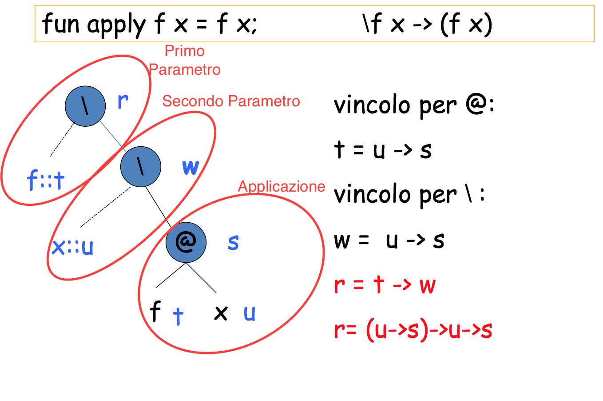

#Lezione 6 - Inferenza dei tipi

In Haskell non è necessario andare a specificare i tipi, si occupa il compilatore di fare *inferenza* di tipo.

##Inferenza di tipo

```haskell
let f x = 2 + x
f :: Num -> Num
```

In questo caso il compilatore inferisce che `x` è di tipo `Num` in quanto `2` è una costante di tipo `Num`.

Il compilatore trasforma `fun f x = 2 + x` in `*lamba*x.((+2)x)` e crea una specie di albero.

Vengono poi valutati i tipi delle foglie, che in questo caso sono `Num -> Num -> Num` per l'operatore `+` e `Num` per la costante `2`.

L'albero è composto da due tipi di nodi: `lambda` o vincoli per astrazione e `@` per i vincoli applicazione.

**Vincolo per astrazione**: `(lambda x.y)` se `x` è di tipo `a` e `y` è di tipo `b`, allora il tipo è `a -> b`.

**Vincolo per applicazione**: se `f` ha tipo `a`, il suo argomento `e` ha tipo `b` e `(f e)` ha tipo `c` allora: `a = b -> c`.

Il nodo `lambda` è associato alla funzione anonima e genera un vincolo `r = u -> s`, con `u` che è una variabile di tipo per `x` e `s` è il tipo del valore di ritorno.

Quando viene valutato il nodo `@` per `+` e `2` il compilatore genera il vincolo `Num -> Num -> Num = Num -> t`. Perché il vincolo sia soddisfatto `t` deve essere uguale a `Num -> Num`

Per l'altro nodo `@` tra `+2` e `x` viene generator il vincolo `t = u -> s`.

Infine, sapendo che `t = Num -> Num` allora `t = u -> s ==> u = Num, s = Num`.

Possono verificarsi delle situazioni *circolari* in cui non si riesce ad inferire in modo automatico i tipo. Questo perché una variabile di tipo può dipendere da un'altra variabile di tipo che a sua volta dipende dalla prima.





_La profondità dell'albero viene influenzata dal fatto che le funzioni sono currificate_.

###Creazione dell'albero

L'albero dell'inferenza è creato da due tipi di nodi, i nodi lambda che hanno come simbolo `\` e i nodi applicazione che hanno come simbolo `@`.

####Nodi lambda

Quando si sta analizzando la definizione di una funzione viene creato un nodo `\`.
Questo nodo sempre come figlio sinistro un parametro della funzione preso in sequenza, cioè il primo nodo `\` ha il primo parametro, il secondo nodo `\` ha il secondo parametro e così via.

Il figlio destro di un nodo `\` può essere o un'altro nodo `\` nel caso la funzione abbia più di un parametro, oppure un nodo `@`.

Un nodo di questo tipo da origine ad un vincolo del tipo:

```
TipoNodoRadice = TipoNodoFiglioSinistro -> TipoFiglioNodoDestro

ad esempio, facendo riferimento all'esempio di prima

r = t -> w
```

####Nodi applicazione

Questi nodi vengono creati quando si valuta l'applicazione di una funzione.

Al contrario dei nodi lambda, in questo caso se la funzione ha più parametri, si espande l'albero a sinistra, questo deriva dal fatto che in Haskell tutte le funzioni sono currificate.

Il figlio sinistro di un nodo applicazione può essere o un'altro nodo applicazione, nel caso la funzione abbia più parametri, oppure una funzione.

Sempre nell'esempio sopra, il nodo `@` rappresenta l'applicazione di `f x`, e da quel nodo si deriva il vincolo `t = u -> s`.

Che generalizzato diventa:

```
TipoNodoFiglioSinistro = TipoNodoFiglioDestro -> TipoNodoPadre
```

Nel caso la funzione richiede l'invocazione di una funzione utilizzi più parametri, come già detto, si espande a sinistra.

Ad esempio l'albero per l'applicazione della funzione `f a b` porta al seguente albero.

```
				  (@)
				/     \
			(@)       b
		  /		\
	   f       a
```


Cioè il figlio destro rappresenta l'ultimo dei parametri dell'applicazione, mentre il figlio sinistro è un'altro nodo applicazione.

Complicando ancora le cose, l'applicazione della funzione `f a (g b)` diventa abbastanza divertente, inquanto entrambi i figli del primo nodo sono entrambi nodi applicazione.

```
				  (@)
				/     \
			(@)	      (@)
		  /		\	  /   \
		f		 a  g		 b
```

Questo perché l'ultimo parametro è il risultato dell'applicazione della funzione `g` sul valore `b`

##Inferenza di tipo per funzioni ricorsive

In questo caso si aggiunge il vincolo che il tipo della funzione deve essere uguale a quello presente come nodo dell'albero.

In modo simile per le funzioni con definizioni multiple deve avere il vincolo il tipo di tutte le funzioni coincida.


