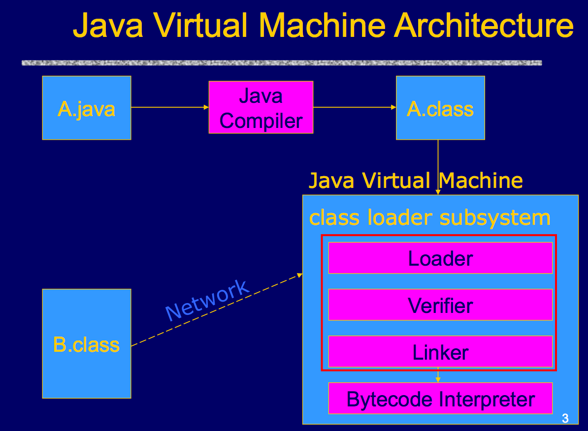
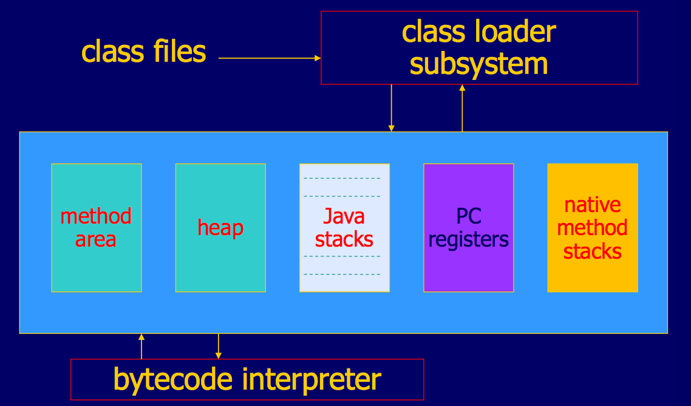
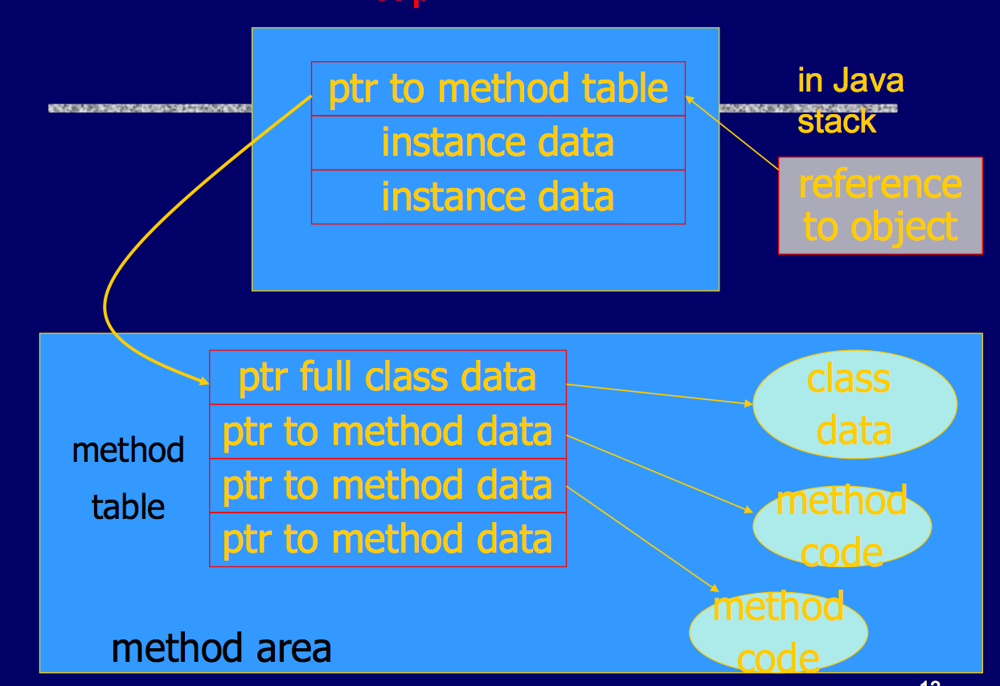
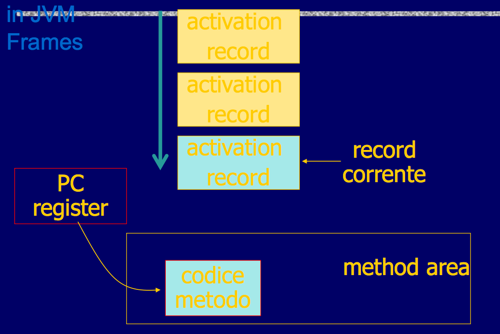
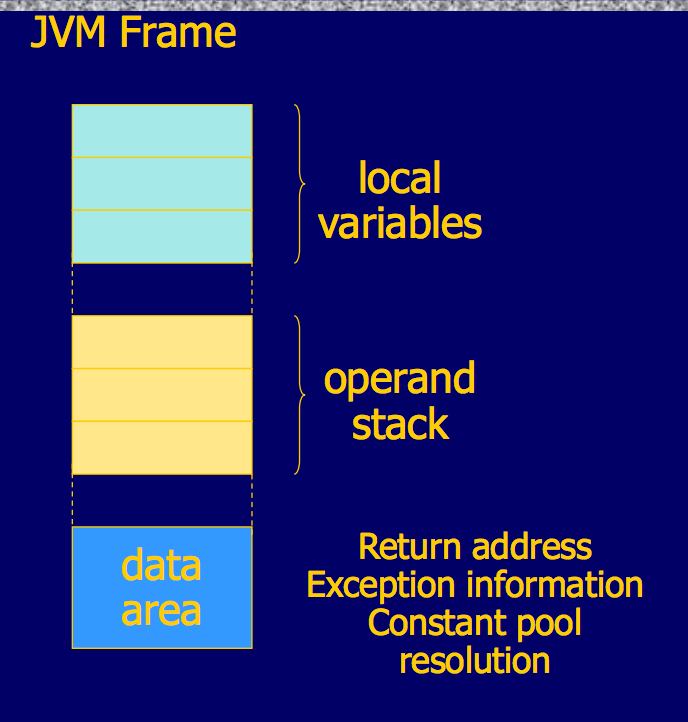

#Lezione 27 - JVM



Il compilatore Java produce un file `.class` che contiene il bytecode prodotto, spetta poi alla JVM eseguire il contenuto del file.

La JVM è divisa in due parti, la prima dedicata al caricamento delle classi e la seconda dedicata all'interpretazione del codice.

La prima parte è poi divisa in 3 moduli:

- Loader
- Verifier
- Linker

## Loader subsystem

La prima parte si occupa di caricare le classi da i vari file quando queste sono richieste.

Il meccanismo di caricamento di default delle classi può essere modificato creando delle sotto classi di `ClassLoader` e che ridefiniscono il metodo `loadClass`.
Lo scopo delle ridefinzione di `ClassLoader` è quello di aggiungere nuovi percorsi possibili per andare a cercare il file `.class`, ad esempio per caricare la classi a partire da un indirizzo di rete.

Durante l'esecuzione del loader vengono eseguiti i blocchi di inizializzazione statica delle classi.

```java
class ... {
 /* static variable with initial value */
 static int x = initial_value
 /* ---- static initialization block --- */
 static { /* code executed once, when loaded */ }
}
```

Questi blocchi statici vengono eseguiti una sola volta, quando la classe viene caricata dal loader e non possono sollevare eccezioni, perché potrebbero non esserci degli handler che le gestiscono.

Il **linker** si occupa di aggiungere al sistema le classi caricate dal loader e di creare i campi statici e inizializzarli.

Il linker si occupa inoltre di risolvere i nomi dei campi dati, ovvero sostituisce il nome dei campi dati di un oggetto con l'indirizzo del record dell'oggetto e il displacement del relativo campo dati dell'oggetto. Es: `this.pippo --> o + disp[pippo]`.

Il **verifier** si occupa poi di controlalre il bytecode prima che questo venga linkato e nel caso si verifichino dei problemi, solleva delle eccezioni di tipo `VerifyException`.

**N.B.**: loader, verifier e linker vengono eseguiti "in contemporanea", ovvero non è proprio una sequenza di fasi ma una cooperazioni tra componenti.

Il controllo fatto dal verifier è necessario perché il bytecode potrebbe essere stato scritto a mano da dei malintenzionati.
Pertanto il verifier controlla:

- La correttezza del operation code delle istruzioni;
- Che i branch delle operazioni confizionali inzino all'inzio di un'istruzione e non a metà;
- Ogni metodo abbia una firma corretta;
- I tipi delle espressioni siano corretti.

## Bytecode interpreter

Si occupa di eseguire il bytecode dell'applicazione.

Durante l'esecuzione, l'interprete si occupa di effettuare i controlli run-time come il bound check degli array.

È inoltre possibile compilare il bytecode in codice nativo.

L'interprete è anche in grado di invocare i metodi nativi, parti di programma scritte in C.

C'è poi da eseguire il dynamic lookup dei metodi, e questo può essere fatto in modi diversi:

- **invokevirtual**: invocazione di un metodo per il quale è noto il tipo statico ed è una classe
- **invokeinterface**: invocazione di un metodo per il quale è noto il tipo statico ed è un'interfaccia
- **invokestatic**: invocazione di un metodo statico di una classe
- **invokespecial**: invocazione di un costruttore

C'è una differeza tra invokevirtual e invokeinterface, perché nel caso di una classe è garantita la conformità e pertanto il dynamic lookup può essere fatto alla C++, mentre per le interfacce è necessario utilizzare del codice diverso.

Per quanto riguarda i controlli di tipo a run-time, questi riguardano anche i cast e il null-dereferencing.
C'è anche la garbage collection automatica, dal momento che non è presente l'aritmetica dei puntatori.

## JVM data areas

Ovvero le strutture dati a supporto dell'interpretazione del codice, un po' come per la macchina SECD del progetto.



- **method area**: area di memoria che contiene le informazioni delle classi (il nome è un po' sviante).
- **heap**: contiene gli oggetti.
- **Java stacks**: area di memoria contenente le istruzioni da eseguire, *stacks* perché ce ne è uno per ogni thread.
- **PC registers**: un program counter per ogni stack.
- **native method stacks**: zona per l'esecuzione dei metodi nativi.



In uno stack della stack area ci sarà un puntatore ad un oggetto allocato nello heap. L'oggetto conterrà poi un puntatore alla sua classe, che si troverà nella method area.

Nella method area si troverà anche la **method table** della classe, un po' come la vtable del C++, con la differenza che in questa tabella c'è anche un puntatore ai **class data**, ovvero i campi dati statici della classe.



Uno stack della stacks area è composto da una pila di record di attivazione e il relativo program counter conterrà l'indizzo di un'istruzione di un metodo che si trova nella method area.



Ogni record di attivazione è composto da 3 parti:

- **local variables**: area contenti le variabili locali, ovvero i valori dei parametri che vengono passati al metodo al quale è associato il record di attivazione.
- **operand stack**: stack contenente gli operandi per le operazioni che devono essere eseguite o per il valore di ritorno.
- **data area**: area contenente le informazioni riguardo l'indirizzo di ritorno, le eccezioni che possono essere sollevate, i risultati parziali delle operazioni, il **costant pool resolution**.

C'è un po' di black magic per determinare la dimensione massima richesta dall'operand stack.

## Class file

```
ClassFile { u4 magic; u2 minor_version; u2 major version;
 u2 constant_pool_count;
 cp_info constant_pool[constant_pool_count-1];
 u2 access_flags; u2 this_class; u2 super_class;
 u2 interfaces_count; u2 interfaces[interfaces_count];
 u2 fields_count; field_info fields[fields_count];
 u2 methods_count; method_info methods[methods_count];
 u2 attributes_count;
 attribute_info attributes[attributes_count]; 
}
```

- `u4` e simili indicano quanto spazio richiede il campo dati che segue.
- `minor_version` e `major_version` specificano un intervallo di versioni per la classe
- `constant_pool` contiene una lista con tutti i nomi simbolici (classi, metodi, campi dati, costanti, stringhe, ecc.) che compaiono nel ClassFile, il formato di ogni elemento della costant\_pool è indicato con un tag di un byte.
- `access_flag` rappresenta le specifiche della classe descritta dal file: accessibilità e se è astratta
- `field_info` è la tabella che contiene i campi dati della classe e contiene solo i campi dati della classe descritta dal ClassFile e non quelli ereditati dalla superclasse.
- `method_info` è una lista che cointene i metodi della classe e, in modo analogo a `field_info` contiene solo i dati della classe e non della superclasse.

> I tag della costant pool non saranno chiesti all'esame

All'interno delle varie liste ci sono delle strutture dati che contengono le informazioni riguardo a quello che rappresentano.
Ad esempio dentro la `constant_pool` potrebbe esserci

```
CONTANT_Class_info { u1 tag; u2 name_index; }
```

con il tag che ha come valore `7` e `name_index` che è un indice per la `constant_pool` che contiene le informazioni riguardanti il nome completo della classe (un oggetto di tipo `CONSTANT_Utf8_info`).

```
CONSTANT_Utf8_info {
    u1 tag; // =1
    u2 length; //Numero di caratteri
    u1 bytes[length] //Array di byte contenente la stringa
}
```

`CONSTANT_Utf8_info` rappresenta una stringa, il significato della quale varia in base agli elementi della `constant_pool` che sono stati "visitati" prima di raggiungere l'oggetto.

La `constant_pool` è quindi un'oggetto che contiene tutte le informazioni in modo spezzettato, ognuna con un riferimento al pezzo successivo.

Tra le possibili strutture dati della `constant_table` possono esserci anche `CONSTANT_Methodref_info` e `CONSTANT_InterfaceMethodref_info` che distinguono i metodi di una classe da quelli di un'interfaccia. Queste strutture hanno poi un campo dati `class_index` che referenzia il nome della classe o interfaccia di appartenenza.

Nella lista `field_info` le strutture dati contenute hanno la forma

```
field_info { 
    u2 access_flags;
    u2 name_index;
    u2 descriptor_index;
    u2 attributes_count;
    attribute_info attributes[attributes_count];
}
```

che è diversa rispetto alle strutture della `constan_pool`.
Per `method_list` la struttara è simile:

```
method_info {
    u2 access_flags;
    u2 name_index;
    u2 descriptor_index;
    u2 attributes_count;
    attribute_info attributes[attributes_count];
}
```

Tra gli attributi del metodo, c'è sicuramente il puntatore al codice.

Grazie a queste strutture dati, l'interprete riesce ad accedere direttamente ai campi dati senza utilizzare il riferimento simbolico. Tuttavia, la ricerca delle informazioni a runtime risulta onerosa in termini di tempo. Anche perché un singolo ClassFile non contiene le informazioni delle superclassi e delle interfacce che implementa.

Perciò viene usata un'ottimizzazione: alla prima esecuzione del codice viene effettuata la ricerca completa per trovare il simbolo corretto nella costant pool, una volta trovato viene modificato il codice sostituendo il riferimento con un offset in modo che per le successive esecuzioni sia possibile accedere direttamente al valore, senza effetturare la ricerca.

L'interprete non si limita quindi ad interpretare il codice, ma lo trasforma in modo da ottimizzare le presetazioni.

Un possibile esempio di bytecode è:

```
aload i //Inserisce in cima al operand_stack il contenuto della i-esima variabile locale 
getfield #18
```

Prima di poter eseguire la `getfield`, l'oggetto del quale si vuole accedere al campo dati deve essere in cima al operand stack.
Da notare che prima di eseguire `getfield` l'inteprete sa già la classe dell'oggetto che potrebbe non essere ancora stata caricata.

Viene quindi acceduta l'entrata 18 della constant pool, la quale deve contenere un `filedref_info` che specifica la classe, il nome e il tipo del campo che si vuole mettere nello stack.
Queste informazioni devono essere in accordo con la classe dell'oggetto in questione.

Assumendo che il campo dati dell'oggetto si trovi a distanza 10 dall'inzio, l'istruzione `getfield #18` viene sostituita con `getfield_quick 10` in modo da velocizzare le successive esecuzioni.


 