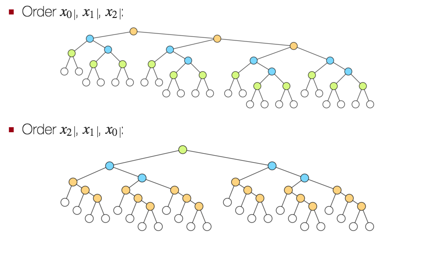
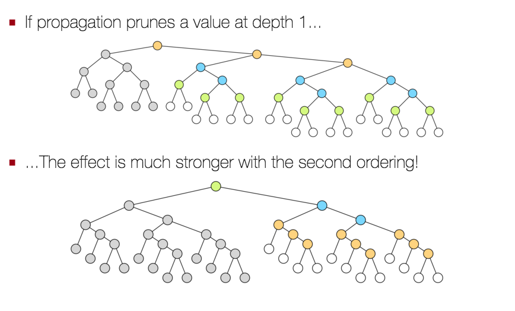

#Lezione 5 - Metavincoli

Non si riesce a modellare in modo efficace il problema dei trasporti, serve quindi una nuova tipologia di vincoli

##Vincoli come espressioni

> z = (x<sub>i</sub> == j)
>
> z = 1 se x<sub>i</sub> = j
> 
> z = 0 altrimenti

In partica *z* diventa una "variabile" che vale *1* se il vincolo è soddisfatto e *0* nel caso non lo sia, un concetto simile alle variabili binarie della programmazione lineare.

Si dice che il vincolo *z* è un vincolo **reificato** (reified constraing), cioè un espressione che corrisponde allo stato di soddisfacibilità di un vincolo.

Un **meta-vincolo** è quindi un vincolo definito utilizzando dei vincoli reificati.

Questa tipologia di vincoli sono molto utili per modellare un problema, tuttavia:

- Portano ad avere dei modelli complicati;
- Portano ad avere dei modelli grandi, quindi serve più tempo per fare filtering;
- Portano ad avere un filtering debole.

###GAC per i vincoli reificati

Il dominio di un vincolo reificato è sempre {0,1}, il valore 1 ha supporto se e solo se c'è la possibilità che il vincolo sia soddisfatto e lo stesso vale per il valore 0.

Si parla di *dominio di un vincolo* perché i vincoli reificati possono essere visti come delle variabili.

Se un vincolo reificato **non** è soddisfatto **non** vuol dire che il problema è infeasible, questo perché un vincolo reificato non è un vincolo del problema originale, ma è un modo di collegare lo stato di un vincolo ad una variabile.

###Filtering per i vincoli reificati

Se *(c)* è il vincolo reificato per il vincolo *c*, prima è necessario filtrare per il vincolo *c*.

Se si ottiene un domain wipeout allora *D(c)* non contiene 1 e se *c* è risoloto, allora *D(c)* non contiene 0.

##Vincoli logici

Servono per risolvere i problemi di soddifacibilità booleana (**SAT**) nei quali bisogna determinare se una clausola booleana è soddisfacibile.

Non serve andare ad aggiungere dei nuovi vincoli, si possono andare a riciclare alcuni vincoli già noti.

> z = not x
> 
> z = (1 - x)

Se *z* e *x* sono variabili binarie le due esperessioni sono equivalenti.

In questo modo si possono riutilizzare le regole di filtering che vengono usate per le espressioni già note.

Allo stesso modo

> z = x ∧ y
> 
> z = x \* y oppure z = min(x,y)


> z = x ∨ y
> 
> z = max(x,y)

Non serve quindi andare ad implementare i vincoli logici in quanto è possibile riutilizzare quelli aritmetici, in questo modo si può riutilizzare anche il filtering e il GAC.

Avendo un modo per mappare i vincoli logici basilari si possono anche andare a definire quelli più complessi come il ⇒ e ⇔, tuttavia la cosa diventa più verbosa.

> x⇔y 
> 
> diventa 
> 
> max(xy,(1−x)(1−y)) 

Ma si può fare di meglio:

> z = (x ⇒ y) = (x ≤ y) //Con un vincolo reificato

> z = (x⇔y) = (x==y)

> z = (x ⊕ y) (xor) = (x != y)

##Wombo combo

Utilizzando i metavincoli e i vincolo logici è possibile andare a definire dei vincoli più complessi come: *Se x allora y*.

Permettendo così di modellare tutte le relazioni combinatorie su variabili discrete.

Tuttavia questa non sempre è una buona idea perché così facendo si ottiene un modello grande e il filtering debole.

Questo perché i metavincoli potrebbero non esse GAC anche se tutti i vincoli individuali sono GAC.

##Riprendiamo la ricerca

L'algoritmo finora utilizzato è il seguente:

```python
def DFS(CSP):
    if sol_found(CSP): return True
    if infeasible(CSP): return False
    for dec in decisions(CSP):
        if DFS(apply(dec, CSP)): return True
    return False
```

- Si prende la prima variabile *x<sub>i</sub>* che non è ancora bound
- Si prende il valore minimo *v*
- Si prendono due decisioni:
    - *x<sub>i</sub> = v* (branch sinistro)
    - *x<sub>i</sub> ≠ v* (se faccio backtracking)

Si può andare a migliorare cambiando la **variable selection heuristic**, cioè cambiare come si sceglie la variabile e **value selection heuristic**, cioè come scegliere il valore per fare il branching.

L'idea è quella di scegliere l'euristica migliore che permette di risolvere il problema.

Questa euristica risulta essere specifica per alcuni tipi di problemi, perché non è possibile trovare un euristica per risolvere un problema generico.

Nei problemi in cui si cerca solamente una soluzione, **l'idea è quella di scegliere sia la variabile che il valore in modo che ci sia una maggior probabilità di arrivare ad una soluzione feasible**.

Tuttavia questa strategia non limita il **trashing**, se si prende una decisione sbagliata e si genera tutto un sotto-albero infeasible è necessario esaminare tutto il sotto-albero prima di accorgersene.

Sarebbe bello avere un modo di limitare questo fenomeno.

Se le variabili hanno domini diversi, queste influenzano la struttura dell'albero di ricerca.




In genere scegliendo come variabile alla quale assegnare un valore, la variabile che ha il dominio più piccolo, si ottengono due grandi vantaggi:

- La propagazione è più forte;
- È molto più probabile che si faccia propagazione.

Si cerca quindi di massimizzare la propagazione scegliendo variabili e valori in modo da causare un fail (**first fail principle**).

Quindi ricapitolando:

- Se si crede che il problema sia feasible, si cerca di assegnare il valore che è più facile che porti ad una soluzione;
- Se si crede che il problema sia infeasible, si cerca di fallire il prima possibile.

Di solito non si sa se il problema è feasible o infeasible, quindi **si sceglie la variabile con il dominio più piccolo** (si cerca il fail) e **il valore che aumenta la probabilità di successo** (varia da problema a problema).