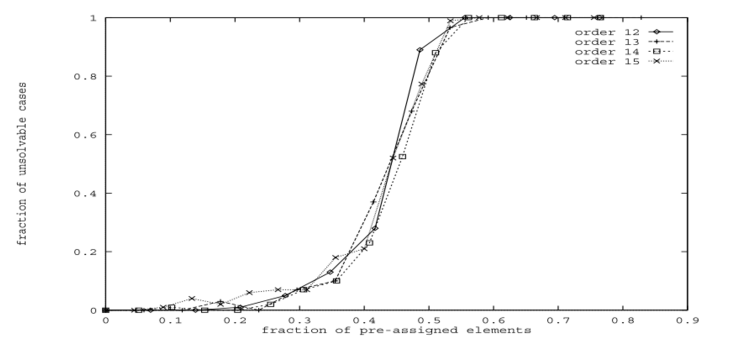
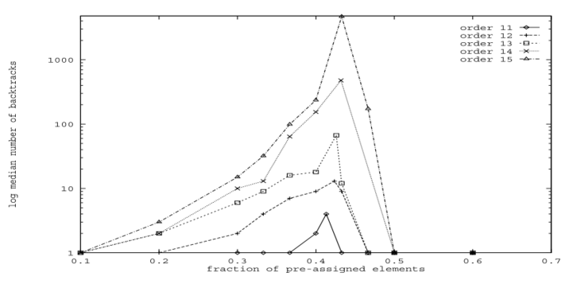
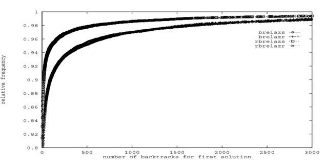
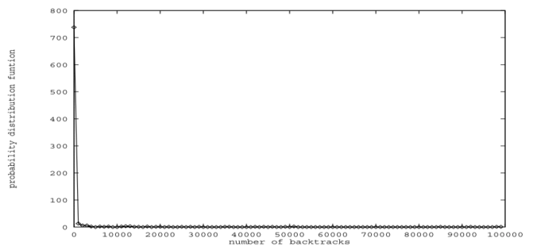
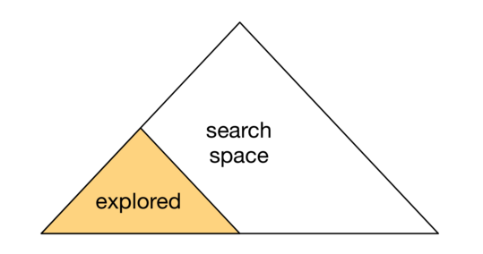
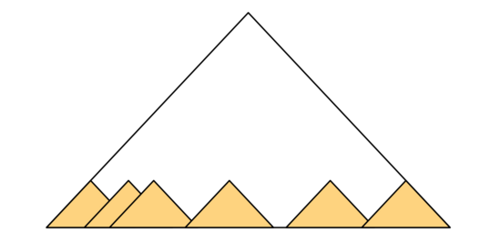
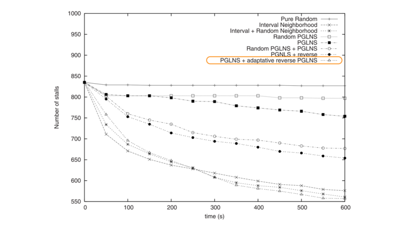
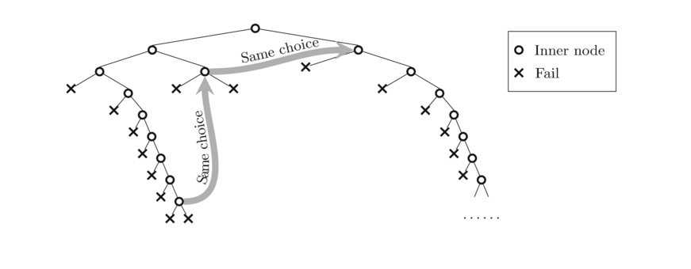

#Lezione 10 - CP e euristiche

Il PLS ha due proprietà interessanti:

1. Ha una **transizione di fase**
2. Le distribuzioni delle prestazioni dei risolutori tendono ad avere una **coda pesante**

Per generare un PLS si possono andare a mettere dei numeri casuali all'interno delle celle.

Meno celle sono riempite, maggiori soluzioni sono possibili e quindi il problema è facile da risolvere.

Allo stesso modo, più celle sono riempite, maggiore è la propagazione e il problema resta sempre facile da risolvere, anche se può essere che non venga trovata una soluzione.

## Phase transition

Andando ad aumentare il numero di celle riempite, si arriva ad un punto in cui la probabilità di trovare una soluzione feasibile varia bruscamente.

Questo prende il nome di transizione di fase ed è molto comune nei problemi combinatori (ovviamente su altri parametri).



Di conseguenza con poche celle riempite ci sono più soluzioni pertanto è più facile trovare una soluzione.

Tuttavia risolvere il problema è facile anche se ci sono tante celle riempite perché queste fanno molta propagazione.

C'è un range di valori per i quali trovare una soluzione difficile e ricadono nella transizione di fase.



Pertanto, se un problema ha una transizione di fase, le istanze più difficili tendono ad essere vicine al punto di transizione.

La transizione di fase dipende da:

- Il problema
- L'approccio con il quale viene generata l'istanza del problema, ad esempio se si usa il riempimento casuale c'è, ma se si parte da un problema feasible e si "torna indietro" non c'è (come per la generazione del sudoku).
- Il metodo di soluzione utilizzato

##PLS e strategie di ricerca

Trovare una strategia di ricerca generale per il PLS non è semplice, utilizzare min-size-domain per scegliere la variabile da assegnare aiuta, ma è difficile andare oltre. 
Questo perché la scelta del valore dipende tanto dall'istanza.



Nel grafico le X rappresentano il numero di backtracking e le Y il numero di problemi risolti.

Questo comportamento è causato dal fatto che ogni tanto l'euristica di selezione del valore/variabile esegue una scelta sbagliata all'inizio della ricerca e pertanto vengono generati tanti rami infeasible.

La cosa brutta è che questi errori tengono ad apparire in modo casuale e sono comuni alla maggior parte dei problemi combinatori.

Tipicamente è facile trovare una buona euristica che funziona generalmente bene, c'è però un problema con i vari tie-breaker.
Per andare a rompere questo si può andare a caso.

###Randomized Search Strategies

Questo metodo esegue una scelta casuale sia della viarabile che del valore.
Così facendo la ricerca diventa stocastica.



Dal grafico si può notare che la probabilità di risolvere un problema con pochi backtrack è molto alta, anche se rimangono delle situazioni in cui possono essere necessari molti backtrack.

Per i problemi combinatori la probabilità di dover fare tanti backtrack è bassa ma non trascurabile.
In questo caso si dice che i problemi sono **heavy tail**, ovvero la coda della distribuzione della probabilità decade con un andamento sub-esponenziale.

La cosa importante è che è facile essere fortunati ed avere pochi backtrack, ma prima o poi ci saranno casi sfigati.

Questo vale sia per un approccio deterministico su problemi stocastici, sia con un approccio stocastico su problemi deterministici.

### Restart

Quando c'è un comportamento heavy tail, conviene effettuare un restart della ricerca dopo un tot numero di fail.
In questo modo non vengono mai raggiunti i casi in cui il numero di backtrack è troppo alto.

Risulta comunque vantaggioso riavviare dal momento che è più probabile trovare un'istanza con pochi backtrack che finire nella coda lunga.
Lo svantaggio c'è quando il problema è infeasbile, perché prima di riuscire ad esplorare tutto l'albero vengono fatti vari riavvii.

La cosa bella è che se il numero di backtrack massimi aumenta, la strategia risulta comunque completa.

Ci sono due strategie di riavvio principale, il numero indica dopo quanti backtrack riavviare:

- **Luby**: 1,1,2,1,1,2,4,1,1,2,1,1,2,4,8,...
- **Walsh**: utilizza una progressione geometrica di ragione *r* con *r* > 1 e tipicamente minore di 2.

Una modifica comune a queste due strategie di riavvio è quella di utilizzare un fattore di scala *s*.


#### Restart e problemi grandi

Per risolvere dei problemi grandi tipicamente è necessario porre un limite di tempo ottenendo un'esplorazione dell'albero di ricerca come in figura.



Utilizzando una ricerca casuale con riavvio è possibile esplorare l'albero in modo più uniforme:



Questo approccio risulta utile anche per il problemi di ottimizzazione, in quanto ogni volta che si ottiene una soluzione migliore di quella corrente si ottiene un nuovo bound.

## Large neighborhood search

Per affrontare COP di grandi dimensioni conviene utilizzare un approccio di ricerca locale, questo perché tipicamente nei problemi reali le soluzioni migliori sono tra loro vicine.

La **Local Search** (LS) utilizza un approccio alla Hill Climbing per cercare nel vicinato di una soluzione, una versione migliore.

Così facendo si ottiene un algoritmo anytime che lavora su un vicinato di dimensioni ridotte e che può essere esteso in modo che possa uscire dagli ottimi locali con tecniche di randomizzazione, simuleated annealing, algoritmi genetici ecc.

**Large Neighborhood search** utilizza un approccio alternativo, considerando un vicinato più grande, in modo che se l'algoritmo si incastra in un ottimo locale, sia in grado di raggiungere un altro ottimo.

Per definire questo vicinato è possibile tenere fissate delle variabili della soluzione corrente e rilassare le altre.
La nuova soluzione viene quindi ottenuta definendo un nuovo CSP che vincola il valore delle variabili tenute fisse (prendono il nome di **fragment**).

LNS ha vari vantaggi:

- Permette di implementare facilmente il grande vicinato grazie a strategie avanzate di ricerca e alla risoluzione di un CSP.
- È più facile da sviluppare, per definire un vicinato basta scegliere delle variabili, al resto ci pensa il solver.
- È più scalabile rispetto ad applicare CP sul problema completo, perché i sotto-problemi che risolve sono più piccoli.
- Ogni sotto problema è risolto in modo più efficiente grazie alla propagazione e alla riduzione dei domini data dalle variabili fissate.

Ci sono però degli svantaggi, infatti, LNS è un approccio basato su euristiche, quindi non è detto che la soluzione che trovi sia ottima e in più ci sono molte scelte progettuali da fare.
Alcune delle quali sono:

- Completezza o incompletezza dell'esplorazione del vicinato: si può fissare un limite alle risorse per effettuare un'esplorazione parziale del vicinato, oppure si può scegliere di esploarlo tutto. Tipicamente si sceglie un limite alle risorse in modo che la probabilità di ottenere un'esplorazione completa sia maggiore del 50%.
- Numero di miglioramenti: dopo quanti miglioramenti l'algoritmo deve terminare? si può scegliere di terminare al primo miglioramento, oppure di proseguire finché le risorse non finiscono.
- Variabili da rilassare dal momento che si potrebbe andare a tagliare dei sotto-alberi che contengono soluzioni ottime.

### Fragment Selection in LNS

La scelta delle variabili da rilassare influenza la completezza dell'esplorazione.

Tipicamente si cerca di rilassare un numero di variabli tale da avere più del 50% di probabilità di ottenere un'esplorazione completa. Nella maggior parte dei casi la scelta delle variabili viene fatta a mano e offre le prestazioni migliori anche se ci sono approcci automatici come **propagation based** o **learning based**.

Degna di nota è anche la scelta casuale delle variabili che funziona abbastanza bene perché garantisce un'esplorazione uniforme dello spazio di ricerca.

### Automatic Fragment Selection

Tipicamente la neighborhood viene determinata dal numero di variabili da rilassare e a causa della propagazione delle variabili, lo spazio di ricerca è più o meno grande.

#### Dimensione dei sotto problemi

Per ottenere dei sotto problemi si può effettuare la propagazione durante l'aggiunta dei vincoli che fissano le variabili:

```python
for i in select_fragment():
        add constraint xi=σ(xi) to P′
        --> propagate until fix point <--
```

In questo modo si riesce a tenere la dimensione dello spazio di ricerca sopra una determinata soglia, inoltre, per misurare la dimensione dello spazio di ricerca si può utilizzare il prodotto carteisano dei domini delle variabili.

#### Scelta delle variabili

La scelta delle variabili da fissare viene effettuata tenendo conto della propagazione.

Si parte da una lista *L* con le variabili non fissate, inizialmente vuota, dalla quale viene scelta quale variabile filtrare. Se la lista è vuota la scelta viene fatta a caso.

Ogni volta che viene fissata una variabile, viene calcolato uno **score** per tutte le altre variabili non ancora fissate.

> score<sub>i</sub> = 1 − (|D(x<sub>i</sub>)∣<sub>after</sub>)/(|D(x)|<sub>i</sub><sub>before</sub>)

Solo le variabili che hanno score maggiore 0 vengono inserite nella lista come possibili candidate per la prossima estrazione.

Essendo un algoritmo commerciale, non viene specificato con che criterio viene estratta la variabile da *L* e cosa succede se si verfica della propagazione sul dominio di una variabile già in lista.
Intuitivamente però, viene scelta la variabile con lo score più alto e nel caso il dominio cambi, si tiene valido lo score più alto.

Questo metodo prende il nome di **Propagation-Guided LNS**, e funziona sotto l'ipotesi che ci siano delle variabili che sono fortemente correlate tra loro e che sia una buona idea tenerle fisse, tipicamente questo è vero per i problemi reali.

C'è anche una versione **reverse** di questo algoritmo, nella quale vengono scelte le variabili da tenere rilassate. L'idea è quella di andare ad allargare lo spazio di ricerca finché non diventa abbastanza grande.

L'idea della versione reverse è corretta ma non è più guidata dalla propagazione ed è più difficile da applicare.

Gli ideatori di questi algoritmi li applicano assieme, viene prima utilizzato PGLNS e poi la versione reverse, finché non viene trovato un sotto-problema della dimensione voluta e nel caso reverse viene utilizzato come score la riduzione media dei domini per ogni variabile nell'iterazione di PGLNS.



## Advanced Search Heuristic

In CP risulta facile andare a definire delle euristiche di ricerca ottimizzate per un problema.

Tuttavia implementare una ricerca ad hoc richiede di conoscere come funziona la CP e tipicamente trovare un'euristica ottima richiede molto tempo.

Se non viene utilizzata un'euristica ad hoc, le prestazioni ottenute sono tipicamente scarse.

Negli utlimi 15 anni sono state proposte delle euristiche generiche che si comportano abbastanza bene.

Queste euristiche si basano su 3 idee principali:

1. **Imparare dalla propagazione e dai fallimenti**: ovvero imparare quali sono le variabili che propagano di più o che più facilemente portano a dei fail, per poi usarle per fare branching.
2. **Ricavare informazioni sui vincoli**: si può sfruttare la rete dei vincoli per calcolare uno score per le variabili
3. **Estrare delle informazioni dai vincoli**: ovvero per ogni vincolo si cerca un algoritmo che stima il numero di soluzioni per quel vincolo e si fa branching sulle variabili cercando di massimizzare queste stime. (forse, vedi slide) 

### Failure Directed Search

Strategia di ricerca progettata per problemi infeasible, in modo da poter prima utilizzare LNS per trovare una soluzione buona e poi applicare FDS per fare la prova dell'ottimalità.

L'idea è quella di andare ad imparare dai fallimenti.

Perché l'algoritmo funzioni, le decisioni di branching devono essere binarie (= e diverso, split di un dominio, ecc.), serve poi un **pool** contenente tutte le possibili decisioni che possono essere prese.

Vengono poi estratte le decisioni da questo pool e se non sono già state prese come effetto collaterale, vengono creati dei nuovi di ricerca e viene fatta la propagazione.
Se alla fine del pool ci sono delle variabili non ancora istanziate, vuol dire che il pool era troppo piccolo e ne serve uno più grande (generazione incrementale del pool per problemi grandi).

```python
P = initial pool of decisions
while len(P) > 0 :
    choose a decision
    if the + or − constraint is satisfied:
        break # the decision is "taken"
    generate + and − search nodes and propagate
    if both nodes fail:
        backtrack
    move to one of the child nodes
```

L'approccio utilizzato è simile a quello di una ricerca DFS con la differenza che le possibili decisioni si trovano all'interno di un pool, in modo da poter tenere traccia di uno score, e la propagazione viene fatta subito per entrambi i branch, perché è necessaria per calcolare lo score.

Lo score di una decisione viene calcolato sommando lo score dei singoli branch:

> **decision score** = s<sup>+</sup> + s<sup>-</sup>

I vari score vengono misurati utilizzando la **reduction**:


ovvero il rapporto tra la dimensione dello spazio di ricerca prima e dopo la propagazione.

Lo score di ogni branch viene calcolato come:


Dove:

- **localstore**: inizialmente vale 1 e ogni volta che un branch viene processato, viene aggiornato con *0* se il branch ha portato ad un fallimento, altrimenti *1+R*.
- **α**: è una costante di invecchiamento, più è vicina a *1* e meno è influente il valore aggiornato, tipicamente varia nell'intervallo *[0.9, 0.99]*
- **depthscore**: è la media dei **decision score**  alla profondità corrente, inizialemente 1. Viene utilizzato per normalizzare i risultati, dal momento che maggiore è la profondità più efficace è la propagazione.

FDS sceglie sempre la decisione con lo score più basso e segue il branch con lo score più basso, questo perché uno score più basso porta ad una propagazione migliore e l'obiettivo di questa euristica è quello di fallire in fretta.

Questa euristica funziona particolarmente bene con i restart, perché al primo giro impara quali sono le decisioni migliori e nelle iterazione successive le prende subito in modo da sflotire il più in alto possibile.

L'utilizzo di FDS porta quindi ad ottenere un albero nel quale i sotto alberi sinistri tendono a fallire più frequentemente e le decisioni che portano ad un doppio fallimento (entrambi i branch falliscono) vengono utilizzate più frequentemente.


