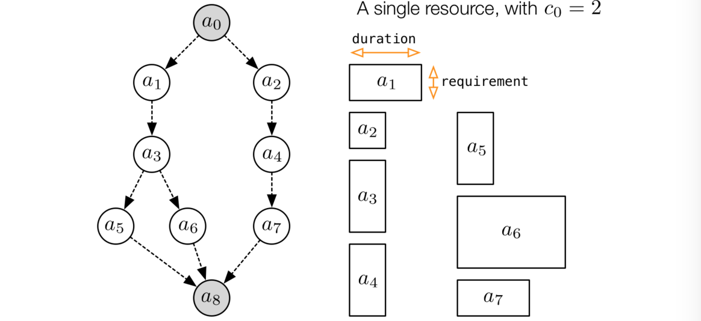
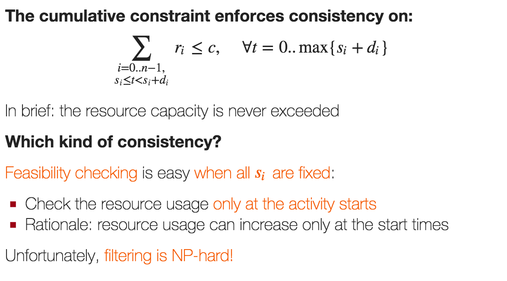
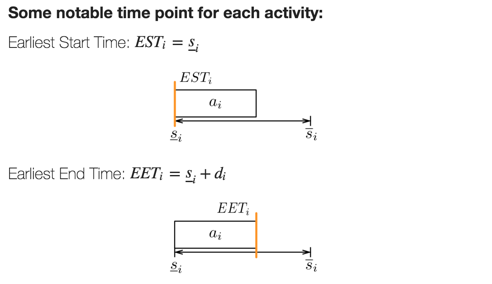
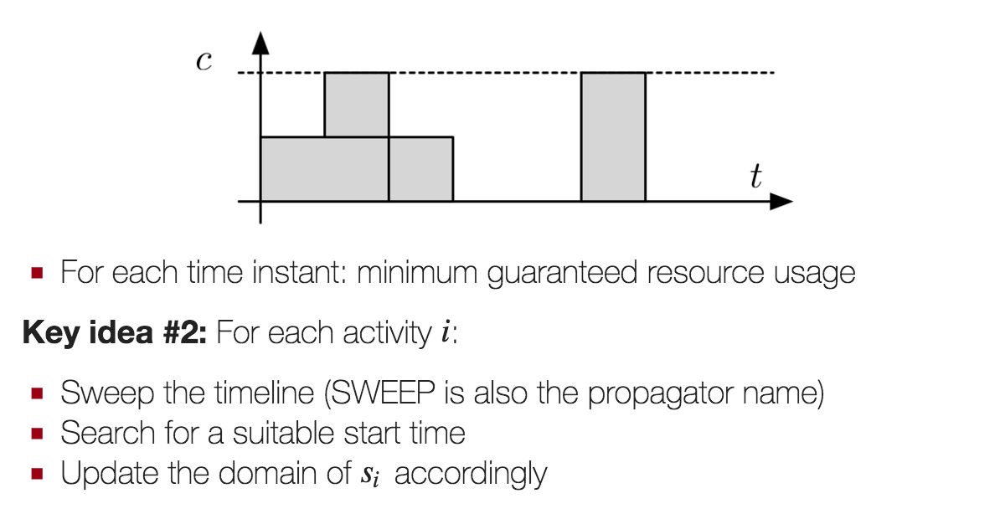
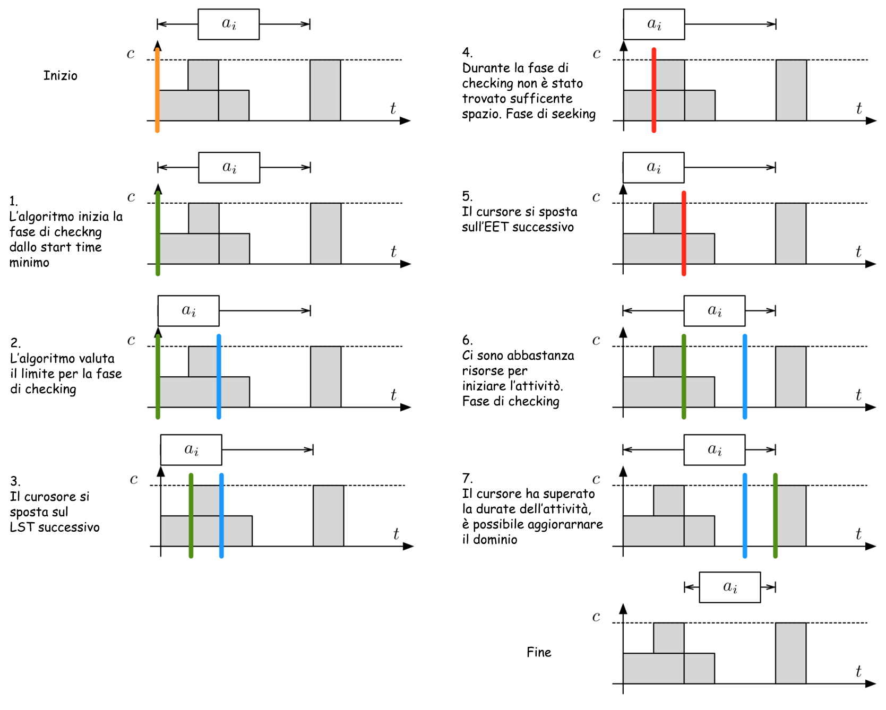

#Lezione 11 - CP e Scheduling

Una delle applicazioni classiche di CP riguarda la risoluzione dei problemi di scheduling, questo perché si riescono ad ottenere ottimi risultati.

##RCPSP - Resource Constrained Project Scheduling Problem

- Ci sono *n* attività con una certa durata
- Ci sono delle risorse limitate ma sono rinnovabili, ovvero quando l'attività termina libera le risorse che occupava.
- Ci sono delle relazioni di precedenza tra alcune attività.

Tipicamente vengono aggiunte due attività farlocche per rappresentare l'inzio e la fine della produzione.

(Nell'esempio dell'immagine c'è un solo tipo di risorsa)

L'obiettivo è quello di minimizzare il makespan, assegnando lo start time a tutte le attività, rispettando i vari vincoli.

Come variabili vengono utilizzati *si* che rappresentano lo start time delle varie attività, con dominio *{0 ... eoh}*.

L'obiettivo è quello di minimizzare la massima terminazione:

> min z = max[i = 0..n−1] (si + di)

mentre le precedenze vengono modellate con

> si + d i ≤ sj

Per le capacità, se queste sono unitarie, modellare il vincolo delle risorse è semplice, basta che due attività che richiedono la stessa risorsa non siano sovrapposte.

> (si + di ≤ sj) ∨ (sj + dj ≤ si)

Se invece le capacità non sono unitarie l'approccio deve cambiare.
Un'idea è quella di andare a mettere tanti vincoli per ogni unità di tempo che controlla che la sommatoria delle capacità non superi la capacità massima.

La propagazione è comunque pessima perché richede dei metavincoli, si può migliorare considerando solo gli intervalli di tempo in cui inizia un'attività.

## Cumulative Constraint

Vincolo globale che permette di modellare il vincolo sulla capacità di una singola risorsa.

> CUMULATIVE(s,d,r,c)
>
> - *s* is a vector of start time variables *si*
> - *d* is a vector of durations *di*
> - *r* is a vector of requirements *ri*
> - *c* is the capacity

Il problema è che fare filtering risulta NP-Hard pertanto gli algoritmi di filtering utilizzati sono sub-ottimi dal momento che fanno un filtering incompleto.
Dal momento che questo vincolo è molto utile, sono stati proposti molti algortimi di filtering (tutti incompleti).

### Timetable filtering

L'idea è quelli di mantenere il controllo dell'utilizzo minimo della risorsa, considerati i vari domini delle variabili.

Se LST di un'attività è minore del EET, c'è di sicuro un intervallo temporale in cui quell'attività sarà sicuramente eseguita.
Aggregando tutte le **compulsory part** di tutte le attvità si riesce a calcolare quante risorse saranno sicuramente richieste.

Una volta ottenuto il **profilo minimo**, si prova per ogni attività a cercare un possibile start time.

L'algoritmo SWEEP utilizza un cursore che parte dal minimo start time per l'attività corrente e si sposta in avanti in **checking mode**.
Ad ogni passo eseguito in checking mode, viene controllato se ci sono abbastanza risorse per eseguire l'attività fino alla fine.
Durante la fase di checking l'algoritmo si sposta solo tra i LST delle attività, perché è solo in quel caso li che il conusmo di risore può aumentare.

Se l'algoritmo in fase di checking si accorge che non ci sono abbastanza risorse per terminare l'attività, passa in modalità **seeking**.
In questa modalità l'algoritmo cerca un nuovo start time per l'attività corrente, ovvero un momeno in cui ci sono abbastanza risorse per permettere l'avvio dell'attività.
Durante questa fase l'algoritmo si sposta solo sugli EET, perché è solo quando finisce una parte obbligatoria che si possono liberare delle risorse.

Quando la seeking mode trova un possibile start time, l'algoritmo torna in fase di **checking** per verificare che l'attività abbia abbastanza risorse per terminare.

Se l'attività riesce a terminare, allora viene aggiornato il minimo start time, utilizzando il punto in cui si è fermato il cursore in fase di seeking, altrimenti è necessario tornare in modalità seeking, alla ricerca di un nuovo possibile start time.

Se in fase di seeking si supera LST dell'attività corrente, il problema è infeasible, pertanto si può terminare con un fallimento.

Il profilo minimo delle attività viene fatto in *O(n log(n))* e può essere fatto durante lo SWEEP. Lo SWEEP ha complessità *O(n)* e deve essere ripetutata *n* volte, quindi la complessità totale è *O(n2)*.

### Edge Finder

*quello che conta è l'idea*

Considera delle coppie *(Ω,i)*, dove Ω è un insieme di attività e *i* è l'attività per la quale si vuole eseguire il filtering.

L'algoritmo stabiliste se l'attività *i* non può precedere le attività in Ω e aggiora *D(si)* sulla base di questa informazione.

Tipicamente funziona bene quando i domini degli start time sono piccoli La complessità è comunque *O(kn2)*.

### Energetic reasoning

Utilizza in concetto di energia, ovvero *risorse richieste per tempo*.

Viene poi valutata la richiesta di energia in determinati intervalli di tempo.
Se questa sfora il limite massimo il problema è infeasible, altrimenti se c'è un potenziale sforamento viene fatto del pruning.

Funziona meglio delle precedenti, ma ha complessità cubica.

### Timetable Edge Finding

Approccio molto recente (2012/2013) che mescola le idee precedenti. 
Ha una complessità *O(n2)* ma che deve essere rieseguito fino al fix point.
Risulta più potente di Edge Finder.

## Strategie di ricerca per il problema di scheduling

- Su che varaibile fare branching?
- Su che valore fare branching?
- Come fare branching?

### Valore da assegnare

Tipicamente l'obiettivo è minimizzare il makespan, far partire il prima possibile le attività aiuta a trovare soluzioni migliori.

In più i problemi di scheduling hanno delle **meteriche di costo regolari**, ovvero metriche per le quali quando aumento il valore di una variabile senza cambiare il valore delle altre peggiorano sempre.

### Variabile da assegnare

Per scegliere la variabile da assegnare si può pensare di prendere quella che ha meno precedenze, tuttavia questa ricerca può essere pesante.

Conviene quindi prendere la variabile che ha lo start time più basso possibile.
Con questa scelta è facile che ci siano molte situazioni di parità, pertanto serve un criterio di tie-breaking efficace, come la scelta della variabile con LET minore, ovvero con la deadline più piccola.

Possono esserci dei pareggi anche in questo caso e tipicamente, una volta raggiunto questo punto, si segue l'ordine dato dall'indice delle variabili.

Questo approccio prende il nome di **priority based scheduling** ed è una famosa euristica per risolvere lo scheduling con le ricerche greedy. 
Non sempre però porta ad avere una soluzione ottima al primo colpo ed è necessario andare a fare backtracking.

#### Backtracking

Impostare il vincolo in backtracking che lo start time sia diverso è troppo debole, dal momento che nei problemi reali i domini sono molto grandi.

L'idea è quindi quella di sostituire il vincolo di diverso con il tag **postponed**. 

Una variabile post-posta non può essere scelta per fare branching finché il suo earliest start time non viene modificato.

Il problema è che questa strategia di branching è **incompleta** perché non esplora tutto l'albero di ricerca.

C'è però una regola di dominanza che deriva dal fatto che la funzione di costo è regolare e che garantisce che la parte di albero non esplorata contenga solamente soluzioni sub-ottime.

La regola di dominanza viene persa nel caso la funzione costo riguardi anche dei costi legati all'immagazinamento, in questo caso conviene utilizzare il domain splitting.

Questa strategia prende il nome di **SetTimes**

## Durate flessibili - Partial Order Schedule

Il problema dello scheduling può comparire anche con la complicazione che le durate delle attività siano stimate, pertanto non è possibile definire subito uno scheduling totale.

Questo problema può essere risolto andando ad aggiungere delle nuove precedenze per evitare dei conflitti nell'utilizzo delle risorse.

Si parte dalla soluzione ottima ottenuta risolvendo il CSP, considerando le durate stimate come se fossero esatte.

Si vanno poi ad esplicitare tutte le precedenze, sia quelle originali, che quelle implicite fornite dalla soluzione ottima.

Rappresentando con un grafo quanto ottenuto e considerando le attività come archi con una richiesta di flusso, è possibile utilizzare un propagatore simile a quello per GCC in modo da trovare solamente le precedenze che fanno parte del POS.

Il POS ottenuto diventa quindi:

