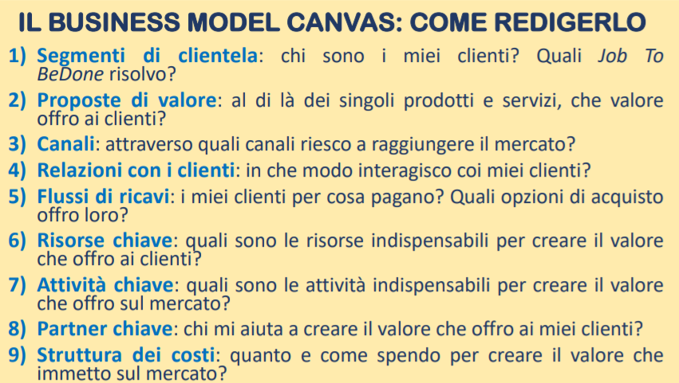

# 🏢 OGA

## Beni e bisogni

**Bene**: inteso come un bene economico, cioè un qualcosa X che è scarsa atta a soddisfare un bisogno.

**Bisogno**: sensazione di insoddisfazione accompagnata dalla consapovolezza dell’esistenza di un bene che possa mitigare questa sensazione.

I bisogni possono essere:

* **fisici**, cioè sono relativi alla sopravvivenza degli esseri umani. Sono anche detti bisogni individuali, naturali o di esistenza.
* **psichici**, cioè collegati allo stato psichico degli umani. Sono anche detti bisogni sociali, relazionali o di civiltà.

### Classificazioni e caratteristiche

Esistono diverse **classificazioni** di bisogni:

* risorgenza **(frequenza)**
  * continui
  * periodici
  * eccezionali
* soggettività **(quanto sono variabili)**
  * variabili nel tempo
  * variabili nello spazio
* **priorità**
  * indifferibili (es. la fame, non puoi rimandare a più tardi)
  * differibili (puoi rimandare)

I bisogni sono **indipendenti e complementari** agli atteggiamenti degli esseri umani (es. mangiare e bere)

### Soddisfare i bisogni: fasi

Per poter soddisfare i bisogni si attraversano due fasi:

* **cognitiva**: dove si **seleziona** (sceglie) un bene (attività **morale**) e si **selezionano le vie più convenienti** per procurarselo (attività **economica**) anche **valutando le alternative** (attività **tecnica**)
* **operativa**: dove si acquisisce e si usa

### Principio del minimo mezzo

Massimo risultato col minimo sforzo.

### Storia dei bisogni

Sin dall'antichità, gli atti relativi al soddisfacimento dei bisogni umani sono svolti da **gruppi economici**. In ordine:

* **autarchico**: gruppo **chiuso**; ha una politica rivolta **all'oggi proprio e al domani proprio**. Si occupa del consumo e di tutta la produzione e produceva un surplus che conservano per loro stessi.
* **specializzato**: si apre al commercio con altri gruppi; si specializza in alcune produzioni e acquista le altre presso altri gruppi economici. Ha sia la politica dall'oggi proprio al domani proprio che dall'oggi e domani **altrui**. Qui, ha origine lo **scambio**
* **diversificato**: nasce il gruppo **bipartito** con due entità: gruppo economico **di produzione** e **di consumo** che si dedicano rispettivamente ad attività **creative** e a quelle **erogative**. Esempio: famiglie (consumo), imprese (produzione).

### Differenza tra soddisfacimento diretto e indiretto

In quello **diretto** il consumo viene affidato alle **famiglie** che vengono chiamate **unità di consumo**.

In quello **indiretto**, prima c'è la **produzione** che viene affidata alle **aziende** (chiamate **unità di produzione**).

### Cosa ha bisogno un gruppo economico

Il gruppo economico per svolgere la sua funzione, ossia produzione e consumo, deve dotarsi dei mezzi necessari: **beni e persone**

## Azienda

### Che cos'è

L'azienda è l'unità operativa mediante la quale i gruppi umani attuano la produzione dei beni al fine del soddisfacimento dei bisogni.

Bullet list di definizioni:

* strumento dell'operare umano in campo economico
* istituto economico atto a perdurare
* sistema di elementi orientato al raggiungimento di un fine
* unità economica elementare
* coordinazione economica in atto che stabilisce rapporti biunivoci con l'ambiente in cui opera

### Azienda individuale vs. azienda collettiva vs. privata vs. pubblica

L'azienda individuale è formata da un singolo individuo tipicamente.

L'azienda collettiva è formata da più individui e si distingue in:

* **privata**: dedicata alla produzione di beni per soddisfare i **bisogni individuali**
* **pubblica**: dedicata alla produzione di beni per soddisfare i **bisogni della collettività** (enti, Stato, Comune, Regioni...)

### Finanziamenti

La produzione e il consumo necessitano di **mezzi finanziari**. Si forma così un **impegno collaterale** attinente alla fornitura di questi mezzi: il **finanziamento alla produzione o al consumo**; le aziende che si dedicano a questo genere di cose, sono le aziende **finanziarie** (anch'esse aziende di produzione).

### Trade offer: aziende e famiglie

### Perché si viene a creare l'azienda? Imprese vs. associazioni

Le motivazioni alla base dell'istituzione di un'azienda possono essere diverse, cioè basate sui **fini**.

* a scopo di **lucro**: **imprese**
* finalità **generali di utilità**: non di lucro, quindi non imprese
  * fondazioni o associazioni
  * enti socio-politici

### Da cosa è costituita un'azienda

 (1) (1).png>)

Da tre cose:

* il **lavoro**, chiamato **organismo personale**
* il **capitale** chiamato **dotazione patrimoniale**
* l'**organizzazione** dal quale scaturisce il rapporto dinamico tra il lavoro e il capitale

### Quali sono i ruoli nell'azienda?

Possono essere di tre tipi, e sono tutti atti allo svolgimento dell'attività:

* **volitivo**: concepimento delle linee guida. L'organo volitivo è conosciuto come "**soggetto istituzionale**".
* **direttivo**: concepimento delle linee strategico-tattiche
* **esecutivo**: attuazione delle linee direttive

### Chi è il soggetto istituzionale?

L'organo volitivo.

### Quali sono le fasi della vita aziendale?

1. Si decide di mettere in piedi un'azienda: si ha un'**idea** e si **progettano** le linee fondamentali. Questa attività la svolge il **soggetto istituzionale** (organo volitivo). Questa fase prende il nome di **lavoro volitivo**.
2. Ci si mettono i soldi: **capitale monetario (o capitale finanziario)**. Questo capitale fa il suo ingresso in azienda in forma **monetaria**
3. Si ha l'acquisizione dei **fattori produttivi**: il **lavoro** (direttivo ed esecutivo), e **utilità** (materiali, come i macchinari, e immateriali come i brevetti). Con l'acquisizione dei fattori produttivi si ha il passaggio da **capitale generico (o investito)** al **capitale specifico (o disponibile)**

#### Capacità vs. utilità potenziale - Attivazione del capitale

Il **lavoro** all'inizio è **capacità potenziale**, mentre il **capitale** è **utilità potenziale**. Tramite un **piano**, devo **sfruttare le potenzialità**, per fare in modo che le capacità **insite** agiscano sull'utilità del capitale. Il capitale in questo modo passa da **capitale inerte** a **capitale attivato**.

## Organizzazione

Funge da moltiplicatore, o riduttore, nei confronti delle capacità e utilità presenti nel lavoro e nel capitale. (**combina le due cose**)

## Gestione

Insieme delle azioni che le persone svolgono applicando le loro capacità alle utilità del capitale.

Ha due momenti:

1. **Astratto (cognitivo)** : decisioni sui comportamenti da attuare --> atti amministrativi
2. **Concreto (operativo)**: attuazione dei comportamenti --> fatti amministrativi (operazioni)

C'è anche una terza fase, ossia quella "post-operativa", anche conosciuta come **di controllo**

### Gli effetti delle operazioni sul capitale

Possono essere **qualitativi** modificando la composizione del capitale (es. denaro proprio, in prestito, investito), o **quantitativi** modificandone la dimensione.&#x20;

## Funzioni amministrative

### Qual è il ciclo di vita di un'impresa?

Si divide in tre fasi:

1. **Istituzione** (creazione): funzioni amministrative **istituzionali**
2. **Funzionamento** (qualunque fase dopo la nascita prima della morte): funzioni amministrative **funzionamento**
3. **Terminale** (morte / fallimento): funzioni amministrative **terminali**

Il **sistema delle funzioni** è il collegamento e l'interdipendenza tra queste fasi.

Raggruppiamo le funzioni in due grandi gruppi:

* **processi**: attività aziendali (processi di vendita e produzione)
* **combinazioni di processi**: raggruppamenti di funzioni amministrative

### Rischio

Il rischio aziendale è l’**insieme dei possibili effetti negativi, e potenzialmente positivi**, che si verificano a causa di un **evento inaspettato** di natura economica, finanziaria, patrimoniale o di immagine.

**Rischio della banca**: Le quattro componenti fondamentali che misurano il rischio sono:

* probabilità di adempiezza
* perdita in caso di insolvenza
* esposizione al momento di adempiezza
* durata effettiva

### Incertezza

L'incertezza è data dalla **non consapevolezza degli effetti** di determinate decisioni ed azioni.

La gestione aziendale si svolge _sempre_ in condizioni di incertezza.

Non è calcolabile.

#### A cosa porta

Può dar luogo a decisioni antifunzionali (**decisioni sbagliate** che portano alle operazioni antifunzionali) o **decisioni funzionali**.

Le **decisioni funzionali** possono portare a operazioni funzionali, dove il rischio è calcolabile. oppure anti-funzionali.

Nelle **operazioni antifunzionali** agisce il rischio, che provoca disagio tra decisioni prese e decisioni convenienti, oppure disagio provocato dall'incongruenza di ciò che sarebbe stato meglio fare e ciò che è stato fatto.

## Azienda individuale

Nell'azienda individuale, il soggetto giuridico e quello economico sono la stessa persona.

### La persona nell'azienda individuale, è sempre unica?

No, possono esserci dei lavoratori subordinati.

### Chi è il soggetto giuridico?

La persona sulla quale convergono diritti e obbligazioni relativi all'azienda.

### Chi è il soggetto economico?

La persona che controlla l'azienda, ne influenza le scelte e trae i maggiori vantaggi dalla sua attività.

### Chi è il titolare?

Il **titolare** (conosciuto anche come **soggetto istituzionale** o **imprenditore**) svolge una plurità di ruoli:

* contrae la **titolarità dei diritti e delle obbligazioni**
* **sopporta il rischio**
* presta il proprio lavoro **sia volitivo che direttivo**
* apporta (ci mette) il **capitale** (conosciuto come **capitale di rischio**)
* **esercita il potere decisionale**

### Accollo delle responsabilità

Spesso il titolare non può svolgere tutto da solo sia dal punto di vista delle attività del lavoro che nelle disponibilità del capitale, quindi **si rivolge a due mercati**:

* mercato del **lavoro** (per cercare prestatori di lavoro)
  * **dipendenti**
  * **autonomi** (ha più libertà)
* mercato del **capitale** (cercare fornitori di capitale)
  * **capitale di rischio** (**denaro proprio** dell'imprenditore)
  * **di credito**

Nell'azienda individuale, il titolare può delegare ad un'altra persone il potere di decidere le linee fondamentali della gestione, ossia il **direttore/amministratore**.

Se ciò avviene, il titolare resta sempre il soggetto giuridico, ma perde la qualifica di soggetto economico.

## Società per azioni

Il **potere decisionale** è nelle mani dell'**assemblea dei soci** (**consiglio d'amministrazione o all'amministratore delegato**) e in particolare al **top management**. Tutti questi sono **soggetti economici**

Il **rischio** resta ai soci ma **limitatamente** all'importo delle **azioni** sottoscritte.

La **responsabilità,** incluse titolarità dei diritti e degli obblighi, si trasferisce alla società, in virtù del riconoscimento legale della personalità giuridica. **La società è il soggetto giuridico.**

## Azienda e ordine

### Azienda

Un complesso composto da **sottosistemi**, ognuno di questi è atto a svolgere una diversa attività, funzione o ha una diversa dimensione.

### Elementi fondamentali

Lavoro (elemento umano) e capitale (elemento materiale). **Dipendono l'uno dall'altro**, e quindi si può dire che l'azienda è un sistema.

Devono essere **coerenti**, cioè orientati verso lo **stesso punto d'arrivo**.

Devono essere **in ordine**, cioè in **relazione** secondo un criterio di razionalità e convenienza (qualità e quantità).

Ci sono **tre categorie** di relazioni:

1. ambito del **lavoro**: le persone devono essere presenti nel modo più adatto per esaltare la forza del lavoro
2. ambito del **capitale**: i beni devono essere presenti nel modo più adatto per esaltare l'utilità patrimoniale
3. tra lavoro e capitale, la **forza lavoro deve combinarsi** al meglio con l'utilità dei beni

### Che fa la direzione?

Coordina questi sottosistemi secondo i tre ambiti.

### Unità dell'azienda

Deriva dalla somma delle singoli componenti (lavoro e capitale)

## I sistemi

Un sistema è:

* **dinamico**: caratterizzato da un movimento continuo degli elementi che lo compongono
* **strumentale**: poiché è lo strumento attraverso il quale gli individui soddisfano i loro bisogni
* **aperto**: si sviluppa in collegamento continuo con l'ambiente esterno, dal quale acquisisce fattori produttivi e cede prodotti

L'ambiente è in continuo cambiamento, e l'azienda **deve essere adattabile al cambiamento**.

## L'ordine

L'ordine è il **presupposto** dell'**economicità** (convenienza economica).

Possono esserci tre tipi di ordine:

* **ordine combinatorio**: riguarda i fattori produttivi (tutti gli elementi necessari nella produzione di un bene)
* **ordine sistematico**: operazioni
* **ordine di composizione**: rapporti con l'ambiente

Ciascuno di loro si manifesta **nella qualità, nel tempo e nella quantità.**

## Equilibrio economico e flussi

Se i ricavi sono tali da reintegrare oltre che i costi storici (quelli iniziali), **anche il deficit** dato dalla differenza tra i costi stessi ed i costi prospettici di riacquisto dei fattori **(di ricostituzione)**, allora quello è un **equilibrio economico**.

### Costi vs. Ricavi

I costi "cedono energia" dell'azienda tramite l'**acquisizione dei fattori produttivi** e **l'utilizzo dei fattori produttivi**.

I **ricavi** "reintegrano l'energia" dell'azienda tramite la **vendita del prodotto ottenuto coi fattori**

### **Le leggi magiche**

* `R >= C`: **inclusione** tra i costi dei fattori produttivi del **costo del capitale di rischio**
* `R >= C + M`: **esclusione** tra i costi dei fattori produttivi del **costo del capitale di rischio**

Nella seconda formula, M sono i costi figurativi (come i compensi al titolare e ai dipendenti, quello per il rischio sopportato dal titolare con l'investimento, conosciuto come **interesse patrimoniale**)

### Redditività vs. Economicità

La **redditività** esprime la capacità della gestione di **generare redditi positivi**.

L'**economicità** esprime la capacità della gestione di mettersi in **equilibrio economico**.

I due coincidono quando il reddito prodotto è equo ed è assicurato per un lungo periodo di tempo.

### Forza di reddito

La **forza di reddito** è la capacità dell'azienda di produrre redditi positivi in maniera autonoma.

### Proiezione

La proiezione nel tempo dell'equilibrio economico richiede la considerazione dei costi e dei ricavi (attuali e futuri).

È una previsione, come un andamento su un grafico.

## Imprenditorialità

L'**imprenditorialità** è l'**insieme delle qualità necessarie** per svolgere con successo il ruolo di imprenditore.

Queste qualità consistono nella **volontà** e **capacità** di promuovere ed organizzare un'impresa economica, e **disponibilità** ad affrontare i rischi.

**È alla base di tutto lo sviluppo e le invenzioni della civiltà umana.**

### Orientamento imprenditoriale

L'attitudine all'imprenditorialità (o **orientamento imprenditoriale**) si manifesta nell'**ideazione**, ma anche nell'**avviamento e gestione** dell'attività.

Nello specifico:

* **ricerca** di soluzioni creative, sfida o confronto con altre imprese per raggiungere sviluppo e miglioramento di prodotti o servizi
* **innovatività,** usare nuove tecnologie e nuove tecniche
* **propensione al rischio**, intraprendere nuovi progetti avventurandosi in ambiti incerti
* **proattività**, intensità con la quale si ricercano nuove opportunità. Chi è spesso proattivo vede le opportunità prima degli altri e agisce prima.

### Imprenditore

L'**imprenditore** è **colui che ha avuto un'idea unica** nella sua mente, e a proprio rischio **l'ha messa in pratica investendo del denaro** (proprio o altrui).

È fermamente convinto delle sue decisioni e convinzioni, nonostante gli ostacoli e le risorse limitate; **non si ferma davanti a nulla**.

Inoltre, **impara dai propri errori e fallimenti**, e cerca di usarli come trampolino di lancio verso il successo.

È in grado, tra le altre cose, di generare una **crescita economica**, capace di **rompere gli schemi** esistenti e consolidati.

### Manager

Il **manager** come l'imprenditore, organizza coordina, dirige, innova e trova soluzioni creative, ma a differenza dell'imprenditore, **non rischia alcun capitale** . Non è un visionario, e crea ricchezza per goderne.

### Differenza tra imprenditore e manager

La differenza tra imprenditore e manger sta nel fatto che **l'imprenditore rischia il suo denaro** ed è colui che ha avuto l'idea (è un visionario), mentre il **manager rischia "solo" lo stipendio,** comunque soldi non suoi.

## Modello di business

Il **modello di business** consente di **descrivere** in modo semplice un business e trattarlo per creare nuove alternative strategiche.

### Da cosa è composto

È composto da **elementi che mostrano la logica** con cui un'azienda intende **creare valore**.

### Ambiente

I **modelli di business** sono progettati e realizzati in ambienti specifici ("**spazi di progettazione**" o "**contesto**"), che **se capiti a pieno** possono portare alla creazione di **modelli di business più solidi e competitivi**.

L’ambiente **dovrebbe influenzare** le scelte progettuali e aiutare a prendere delle decisioni consapevoli.

Può essere utile immaginare l’ambiente esterno come il **contesto** in cui creare o adattare il proprio modello di business, **tenendo presenti diversi fattori guida della progettazione** (es. nuove tecnologie, nuove esigenze dei clienti) **e vincoli progettuali** (es. vincoli normativi e/o burocratici)

### Mapping ambientale

È utile mappare le principali quattro aree dell’ambiente poiché conoscere l'ambiente riflettendo sulle tendenze future permette di considerare meglio le direzioni in cui il modello potrebbe evolversi.&#x20;

1. **Forze del mercato:** bisogni e richieste dei clienti, problemi del mercato, segmenti di mercato, costi di transizione ed attrattività dei ricavi
2. **Forze del settore:** fornitori, concorrenti consolidati, stakeholders, prodotti e servizi sostitutivi
3. **Forze macroeconomiche:** condizioni del mercato globale, infrastruttura economica e finanziaria, mercato dei capitali del lavoro e delle materie prime
4. **Tendenze chiave:** tendenze tecnologiche, economiche, sociali, culturali e normative

Siccome **non c'è certezza nel futuro** e ci potrebbero essere una serie di imprevisti, è utile **fare una serie di ipotesi** riguardanti il modo in cui il mercato, il settore, le tendenze macroeconomiche, si evolveranno, permettendo di **creare l'ambiente** dove sviluppare delle potenziali opzioni per i modelli di business o i prototipi per il futuro.

### Come valutare i modelli di business

Serve a conoscere lo stato di salute della propria posizione sul mercato e agire di conseguenza.

Può essere uno spunto per apportare **modifiche incrementali** (ancora Agile) o per **innovare** il modello.

.png>)

Esistono **due tipi** di valutazione**:**

* Valutazione del **quadro generale:** analizza il modello nel complesso
* **Analisi SWOT** dettagliata di ciascun elemento di base: analisi dei punti di forza e debolezza, opportunità e rischi svolta per ciascuno dei 9 elementi che caratterizzano un modello di business

### SWOT

.png>)

**Strumento** che fornisce **quattro prospettive** da cui analizzare il business.

Viene combinato con il canvas.

Le quattro prospettive sono:

* punti di forza
* punti di debolezza
* opportunità
* rischi

Le prime due valutano l'organizzazione internamente, **fornendo un'istantanea della situazione attuale;** le ultime due la analizzano nel contesto in cui opera e **suggeriscono traiettorie future**.

L’analisi SWOT potrebbe però condurre a discussioni troppo vaghe, perché è così **aperto** da non stabilire vincoli sugli aspetti da analizzare, **finendo così per risultare inutile**.

## Gli elementi di un modello di business

* **segmenti di clientela**: si rivolge a uno o più segmenti
* **partner chiave**: alcune risorse si ricavano da fuori
* **attività chiave**: tutte le attività che offre un'azienda
* **risorse chiave**: beni necessari per offrire la proposta di valore descritta nei altri punti
* **proposte di valore**: cosa offre l'azienda rispetto alle altre
* **relazioni con i clienti**: stabilite e mantenute secondo ciascun segmento di clientela
* **canali**: il mezzo con cui si raggiungono i clienti
* **struttura dei costi**: perché il mio modello è migliore per i costo
* **flussi di ricavi**: ricavati dalla proposta di valore

### Segmenti di clientela

Gruppi di persone con caratteristiche ed **esigenze simili**.

I gruppi sono rappresentati da segmenti distinti se:

* i loro bisogni richiedono un'**offerta distinta**
* vengono raggiunti con **canali diversi**
* hanno **redditività diverse**

#### Tipologia di segmenti di massa

* mercato **di massa**: **unico**, grande gruppo di clienti con bisogni simili (es. pasta, la mangiano tutti)
* mercato **di nicchia**: molto **specializzato** (es. pasta per celiaci)
* mercato **segmentato**: segmenti con esigenze e problemi simili ma al contempo molto diversi (es. uno è ricco e uno è meno ricco, c'è la Ferrari e c'è la Fiat, ma entrambi i segmenti hanno bisogno di spostarsi tra due punti)
* mercato **diversificato**: due segmenti con problemi ben diversi (Amazon Shopping e Amazon AWS)
* piattaforme **multi-sided**: es. Mastercard ha bisogno sia dei negozianti che dei clienti con una carta di credito, quindi i segmenti sono **interdipendenti tra loro**

### Proposta di valore

Una proposta di valore **crea valore** per uno specifico segmento di clientela attraverso un insieme di elementi.

È un insieme di **benefici che l'azienda offre** ai clienti; essa soddisfa un bisogno della clientela.

Questo è il motivo per il quale i clienti passano da un'azienda all'altra.

Le proposte possono essere:

* **innovative** --> nuove opportunità
* **simili** già a quelle esistenti --> però con caratteristiche aggiuntive

Caratteristiche:

* prezzo, design, novità
* status, risolve problemi, convenienza
* riduzione dei costi e dei rischi, performance, personalizzazione

### Canali

Modo in cui un'azienda **comunica con i propri segmenti di clientela** e li **raggiunge** per portare loro la proposta di valore.

Costituiscono l'**interfaccia dell'azienda** nei confronti dei suoi clienti.

#### A che servono

Svolgono le seguenti funzioni:

* far crescere la **consapevolezza** riguardo i prodotti / servizi
* aiutare i clienti a **valutare la proposta di valore** e ad **acquistare** specifici prodotti (in che modo i clienti possono acquistare da noi?)
* **distribuire** la proposta di valore ai clienti
* **supporto post-vendita**

#### Tipologie dei canali

I canali sono possono essere:

* **propri**
  * diretti e indiretti (margini più alti ma costi elevati)
* **dei partner**
  * margini minori ma permettono di guadagnare in visibilità

### Relazione con i clienti

Si occupano di **assistenza personale dedicata**, di self-service, di **community** e di **co-creazione** (es. youtube)

#### Catena dei clienti

Acquisizione --> fidelizzazione --> incremento vendite

### Flussi di ricavi

Rappresentano il **denaro che un'impresa ricava** da ciascun **segmento di clientela**

La domanda che l'impresa dovrebbe porsi è: "per quale valore ciascun segmento di clientela è veramente disposto a pagare?"

Esistono due tipi: pagamenti **in un'unica soluzione** oppure **continui**.

I prezzi possono essere **fissi** che **dipendono** dal **segmento** di clientela e dalle **caratteristiche del prodotto** oppure **dinamici** come il **mercato in tempo reale** (aste o trattative).

**Modi per generare flussi**: Pubblicità, leasing/noleggio, licenze, canoni d'uso, vendite di bene, quote d'iscrizione, commissioni

### Risorse chiave

Ciascun modello di business, per funzionare, richiede risorse chiave.

Queste permettono di creare la proposta di valore, raggiungere i mercati, mantenere le relazioni e ottenere dei ricavi.

Possono essere:

* di proprietà
* noleggiate
* acquisto da partner strategici

#### Tipologie

Le risorse **fisiche** sono quelle come gli edifici, gli impianti di distribuzione o i punti vendita.

Le **intellettuali** sono i brevetti o il copyright.

Le **umane** sono i designer.

Le **finanziarie** sono i contanti e linee di credito.

### Attività chiave

Definsice le azioni più importanti che un'azienda deve compiere affinché il suo modello funzioni ed esattamente come le risorse chiave permettono di creare la proposta di valore, raggiungere i mercati, mantenere le relazioni e ottenere dei ricavi.

Un esempio sono il problem solving (analisti / studi di consulenza), piattaforma / rete (ebay)

### Parnership chiave

Le aziende danno vita a **partnership** per **ottimizzare** i propri modelli di business, **ridurre i rischi** e **acquisire risorse particolari**.

Quelle più comuni sono "**acquirenti-fornitori**" (es. pizzaiolo), però ne esistono di altre tipologie, come le **alleanze** strategiche tra **non-correnti** (fortnite-marvel), **alleanze tra concorrenti** (Samsung e Google danno vita a WearOS) oppure **join venture** per sviluppare nuovi business, dove si punta a condividere la conoscenza.

### Struttura dei costi

In alcuni modelli di business la bassa struttura dei costi è più importante (rispetto ad altri modelli).

I modelli di business possono essere divisi in base ai **costi** e in base al **valore**.

I costi **fissi** si differenziano da quelli variabili poiché i primi **rimangono fissi** indipendentemente dal prodotto.

L'economia **di scala** si differenzia da quella **di gamma** poiché **nella prima** c'è una riduzione dei costi quando la **produzione si espande**, mentre **nella seconda** quando il **raggio d'azione si espande**.

## Canvas

Il canvas è uno strumento visivo che permette di rappresentare i buiness model, e che favorisce la comprensione, l'analisi, la discussione e la creatività (avendo infatti un approccio grafico).

### A cosa serve

Ha due funzioni principali:

* comprendere **come funziona** il business, offrendo una panoramica visuale ed immediata su come funziona l'impresa
* **ideare nuovi modelli** di business, ragiona su "solo" nove blocchi per esplorare nuove opportunità

### Come si fa

Per usare al meglio il canvas, lo si deve **stampare** su una bella superficie grossa, in modo tale che il gruppo possa discutere delle varie idee attraverso i post-it.

Bisogna **scrivere su ogni post-it un'idea** che poi verrà attaccata nel riquadro giusto.

Di solito **si parte dai segmenti di clientela.**

## Jobs (to be done) Theory

.png>)

I clienti non si limitano ad acquistare beni, ma chiedono loro di **svolgere un compito molto specifico** a seconda della situazione, ossia è come se "assumessero" i prodotti e li "licenziassero" quando non ne hanno più bisogno.

### Teoria "cliento-centrista"

 (1).png>)

Il cliente è **al centro di tutto**. Fino a qualche anno fa, l'imprenditore aveva la sua attenzione a vendere i prodotti, ora il focus lo ha sul cliente.

Il cliente **deve essere coccolato**; l'imprenditore deve **conoscere e sapere i gusti** dell'utente in modo da potergli fornire un **prodotto su misura**. Se non riesce a soddisfare i need dell'utente, dovrà fare **ricerche** e cambiare la **proposta di valore** del prodotto.

### La verità sui prodotti

Qualsiasi prodotto **non ha nessun valore intrinseco**, ma lo ha solo nella misura in cui **risolve un problema** del cliente.

Perciò dobbiamo pensare ai clienti come **persone in cerca di un job specifico** anziché un prodotto.

### Tipologie di job

Job **funzionali**: legati a **compiti da svolgere**

* Aspirapolvere

Job **sociali**: come il cliente **vuole apparire** agli occhi della società

* Instagram

Job **emozionali**: come si **vuole sentire** il cliente

* Ikea o Amazon: ci tengono a far sentire il cliente come se fosse a casa e danno una sensazione di sicurezza

## Progettare

L’attività del progettista consiste nel **generare nuove possibilità** e **creare valore** per gli utenti.

C'è una **continua ricerca** del miglior modo possibile per **trovare la novità**, scoprire ciò che ancora non è stato esplorato e raggiungere ciò che funziona (una specie di innovazione ma "gestionale").

## Progettazione (simil-Agile UCD)

.png>)

Se non conosci o non hai mai fatto Interazione Uomo Macchina (IUM), le fasi vengono comunque spiegate. È comunque opportuno rileggerle quindi si suggerisce di **non saltare questa sezione,** ma fa comodo ricordarsi che sono simili a quelle di IUM.&#x20;

Agile è una metodologia di lavoro; alcuni dei suoi punti chiave sono: lo sviluppo iterativo e incrementale delle funzionalità, lavorare in gruppi di lavoro diversificati in modo da avere tante persone con tante competenze su ambiti diversi e la pianificazione del progetto che si adatta a seconda della situazione.

UCD sta per user-centered-design, ed è ciò che è stato spiegato nella [#teoria-cliento-centrista](oga.md#teoria-cliento-centrista "mention").

Fasi:

1. Comprensione della clientela
2. Ideazione
3. Il pensiero visuale
4. Prototipazione
5. Storytelling
6. Scenari

### Comprensione clientela e profilazione

Bisogna tenere in considerazione la **prospettiva dei clienti**, ossia il loro punto di vista.

Questo tipo di approccio può portare alla scoperta di opportunità completamente nuove; lo si fa attraverso interviste e questionari tipicamente, e bisogna stare molto attenti a prendere in considerazione i **lead user** (utenti con **need speciali** al quale probabilmente siamo interessati) e tralasciare gli **extreme user** (utenti che possiamo ignorare, perché hanno need **troppo specifici**)

### La profilazione e i suoi compiti

Attività che consiste nel tracciare **una specie di identikit del cliente, "segmentato" in base ad alcune caratteristiche** come quelle demografiche (come sesso, età, stato civile, professione, reddito, .. ) o quelle socio-psicologiche.

La profilazione aiuta ad elaborare un modello di business più forte in quanto:

* **aiuta a progettare migliori proposte di valore**, modi più efficaci di raggiungere i clienti e relazioni più adeguate con i clienti stessi.
* **permette di intuire** meglio ciò per cui un cliente **è disposto a pagare**

### Ideazione

L’**ideazione** è il processo creativo che **porta alla generazione di molte idee**.

Esistono due fasi:

* **brainstorming**: fase in cui il team genera tantissime idee
  * tipicamente si annotano sul canvas scrivendo le idee o (schematizzandole con disegnini) sui post-it
* **selezione**: dalla fase precedente si tirano fuori le **idee migliori**, ovviamente **tenendo conto di fattori** come costi di implementazione, resistenza dei clienti e redditività potenziale

I concetti chiave sono:

* **non copiare**
* **non guardare indietro**: 'copiare' non vuol dire 'innovare', vuol dire 'copiare'
* **essere originali** e andare incontro a nuovi need
  * tipicamente si usano le domande **what-if** (basta ricordarsi **Ikea: prima nessuno montava i propri mobili a casa**, loro invece l'hanno fatto per primi per risparmiare sui costi, ma hanno puntato su questo e si sono chiesti "cosa succederebbe se per risparmiare sui costi non montassimo i mobili ma la gente se li montasse in autonomia?")
* **avere un buon team**: di solito hanno età, background e competenze diverse, in modo tale che si possano avere quanti più punti di vista possibili

Esistono quattro tipologie di innovazioni:

* guidate dalle **risorse**
* guidate dall'**offerta**
* guidate dal **cliente**
* guidate dagli **aspetti finanziari**

### Prototipazione

Il **prototipo**, esattamente come suggerisce la parola stessa, **non è il prodotto finale**. Può essere soggetto a cambiamenti, ed anzi, è importantissimo che ci siano le revisioni, poiché é improbabile progettare qualcosa priva di difetti sin da subito.

Nel mondo del business, si presenta come un **foglio di calcolo** che simula il funzionamento finanziario di un nuovo business o come un vero e proprio **business plan**.

### Storytelling

Una persona tipicamente è più incuriosita da una storia che da uno schema.

Nasce così lo **storytelling**, ossia l'arte del 'raccontare storie'.

Nel business lo si fa **raccontando** (tipicamente ai manager, ma non solo) il proprio business plan, **spiegando efficacemente con una storia** ciò che si ha in mente. Chi ascolta si immedesima di più nelle situazioni se ascolta una storia ben raccontata, rispetto a un semplice schema.

Serve a:

* **presentare la novità** ai vari livelli del management
* **raccontare agli investitori** come anche loro faranno i soldi
* **convincere i dipendenti** attirando la loro attenzione e curiosità

### Scenari

Aiutano gli innovatori a riflettere sul modello più appropriato per ciascuna delle ambientazioni future (**Scenario Planning**), rendendo visibile ciò che è "astratto".

Danno forma al processo di sviluppo del modello di business, **illustrando** in particolare **il contesto** nel quale si progetta.

Sono utilizzati **due** tipi di scenario:

1. **configurazione dei clienti**: descrivono come vengono usati i prodotti e i servizi, quali tipologie di clienti li usano, quali sono i loro obiettivi, desideri, preoccupazioni....
2. **ambienti futuri**: in cui il modello di business si troverà a competere

Servono per **immaginare** possibili futuri, ma non possono predire il futuro.

## Introduzione al business planning

.png>)

### Pianificazione e BP

La **pianificazione è come una mappa intelligente** che ci dice, **dove si è e dove si sta andando**, se stiamo andando nella direzione giusta, aiuta ad aggirare gli ostacoli, supporta un utilizzo efficiente ed efficace delle risorse e aiuta a ridurre le conseguenze di eventi imprevisti, **abbassando il livello del rischio imprenditoriale**.

Il **business plan è come una bussola** che può darci degli elementi per prendere delle decisioni razionali manageriali alle sfide di mercato. Essa **è la chiave per accedere ai canali di finanziamento.**

Se, dopo aver ottenuto i fondi (finanziamenti), la visione, le strategie e i piani operativi vengono disattesi, l’acquisizione delle risorse finanziarie si traduce in un risultato inutile e i finanziamenti, si trasformano in obbligazioni contrattuali che soffocano la liquidità dell’azienda.

### Pianificazione vs. Programmazione

**Pianificazione**

È un processo composto da due **componenti fondamentali:**

1. **identificazione degli obiettivi** (medio-lungo termine)
2. **identificazione dei mezzi utili** per conseguire gli obiettivi

**Caratteristiche**:

* visione strategica di **lungo termine**
* serve a **valutare le scelte strategiche**
* si possono fare **analisi di sensitività**
* utile al **management**
* 1-**n** anni
* approccio: bottom-up
* documento: **business plan**

**Programmazione**

* programmi di **breve termine**&#x20;
* serve come **motivazione dell'organizzazione**
* si può misurare **efficacia ed efficienza** della gestione di uno o più componenti elementari
* 1 esercizio
* utile ai **responsabili operativi**
* approccio: top-down
* documento: **budget**

### Excellent business plan

Borello ha scritto questo libro, disponibile all'indirizzo [https://excellentbusinessplan.com](https://excellentbusinessplan.com) che può aiutare in caso si voglia migliorare la pianificazione imprenditoriale.

### Vision imprenditoriale e pianificazione

L’imprenditore possiede la "**visione imprenditoriale**" (vision), ossia un **approccio razionale**, che studia le variabili interne ed esterne all’organizzazione aziendale e che consente di seguire le evoluzioni ambientali e di mercato.&#x20;

La vision guida l’imprenditore verso un **orizzonte strategico e non operativo**.

## Business planning

Il **Business Planning** è un **approccio analitico alla pianificazione** imprenditoriale **** che **traduce la vision in un piano di azione vero e proprio**, chiamato "**piano operativo**" che consente di fare stime di costo e di ricavo più dettagliate, avendo cura di analizzare il contesto, i concorrenti e la clientela target.

### Fasi

1. Fattibilità **economica**: piano di fattibilità economica
2. Fattibilità **economico-finanziaria**: piano economico-finanziario (**business plan**)
3. Fase **operativa**: avvio dell'azienda: piano operativo

### Approcci

Si hanno tre approcci principali:

1. **Tradizionale:** basato su analisi di mercato
2. **Lean:**  basato sulle azioni, sugli esperimenti e sui feedback dal mercato
3. **CLIP:** un misto basato su entrambi

### CLIP

Passi **iterativi**: Originalità, Fattibilità, Commerciabilità, Sostenibilità

Vicino al **lean** poiché ci si concentra nella **creazione di un prototipo**.

Vicino al **tradizionale** poiché vengono studiati tutti gli elementi del modello di business.

Quando il test ha successo, l'imprenditore torna al prototipo e lo **elabora** in una versione più sofisticata, tornando alla fase di Pianificazione (Scalabilità).

* ancora una volta, è sempre Agile, cambia l'ambito ma il concetto è sempre lo stesso

## Business Plan

Il **business plan** è un documento prodotto dal business planning ed è lo **strumento** alla base di un processo di pianificazione sistematico ed efficace (business planning).

### Altre funzioni

Nella prima stesura il business plan è una sorta di bussona, utile a **formulare decisioni** di convenienza economica o finanziaria di determinate iniziative, che si possono concludere nella scelta di due o più strategie oppure nell'abbandono completo delle iniziative per mancanza dei presupposi reddito-finanziarli.

È importante per **l'ottimizzazione finanziaria** della copertura degli investimenti pianificati, e può essere usato come strumento di analisi preventiva quando si richiede una qualsiasi forma di sostegno economico (es. finanziamento).&#x20;

### Le domande

Risponde a tre domande:

* **Dove siamo**: fotografia dello stato attuale dell'azienda, inclusa la storia, l'evoluzione e le caratteristiche di ciò che offre. È l'**attuale posizione di mercato.**
* **Dove vorremmo essere**: dimensione strategica: la direzione che prenderanno i fondi di investimento del direttore e/o del manager&#x20;
* **Come ci si arriva**: è la fase attuativa, vengono messi in pratica i principi stabiliti con la domanda "dove vorrei essere" la decisione è importante quanto la comunicazione a tutti i membri dell’organizzazione delle azioni che si intende intraprendere per il raggiungimento dei target

Per rispondere correttamente a queste domande occorre fare un'analisi **sia interna** (idee e obiettivi dell'imprenditore) **che esterna**  (ambiente / contesto).

### Esiste un piano standard?

No. Tutto dipende dai fattori interni ed esterni, da come è composto e strutturato il business, dagli imprenditori, dalla sua esperienza...

### Come è composto

Ha due sezioni:

* parte **descrittiva**: cioè, analisi e studi necessari per comprendere il mercato, la concorrenza, il prodotto offerto e il piano strategico-operativo
* parte **economico-finanziaria**: che copre molte aree di analisi, investimento e bilancio. Permette di interpretare i dati raccolti nella prima parte e usarli come guida per la valutazione del progetto

### A chi si rivolge

Può rivolgersi alle **startup** poiché permette di avere una stima della probabilità di successo e del rischio imprenditoriale.

Può anche rivolgersi ad una **attività già avviata** per tradurre la visione imprenditoriale a lungo termine in **guida alla gestione corrente** del business.

### Funzione interna vs. esterna

La funzione **interna** è la funzione che ha all'interno dell'azienda, ossia di essere una **guida** (una mappa).

La funzione **esterna** è la capacità che il business plan ha di essere uno strumento per **persuadere che l'idea è buona** (es. verso gli investitori prima che investano nel prodotto)

### Documenti intermedi

Ci sono due principali documenti intermedi, che sono sintesi di quello che è stato deciso o fatto.

* **executive summary:** documento di due/tre pagine. È il **biglietto da visita del business** poiché viene presentato a chi dovrà promuovere il business. **Richiede particolari doti di scrittura,** poiché molto complesso: vengono introdotti tantissimi temi come le caratteristiche del progetto, i suoi ambiti, la strategia perseguita, lo stadio di sviluppo e i principali risultati economico-finanziari attesi.
* **investment memorandum** un documento di 15-20 pagine, che ha gli stessi temi dell'executive summary, trattati però in maniera molto più dettagliata. I dati economico-finanziari **non sono presentati in modo analitico** ma sono limitati ad alcuni indicatori di **redditività e sostenibilità finanziaria**, in alcuni casi affiancati da un’analisi di sensitività delle ipotesi di calcolo effettuate.

## Struttura organizzativa

È il modo di funzionare di un'organizzazione (**come funziona un'organizzazione**), che rappresenta un sistema di processi e attività di organizzazione.

Strutturare serve a **ottimizzare i processi** e le attività in base alla **tipologia** di prodotto/mercato e all’ambiente esterno.

La tipologia di struttura è generalmente identificata dalla prevalenza del **coordinamento verticale o di quello orizzontale**.

### Comunicazione orizzontale vs. verticale

La comunicazione orizzontale significa **trasmettere le informazioni** tra persone, divisioni, dipartimenti o unità **all’interno dello stesso livello** dell'organizzazione.

La verticale significa **trasmettere le informazioni tra diversi livelli** della struttura organizzativa.

## Tipologie di strutture

Esistono tre tipologie di strutture:

* funzionale
* divisionale
* matrice

### **Funzionale**

Prevale il **coordinamento verticale.**

C'è una **forte struttura gerarchica** con **regole rigorose**, è stabile ed è utilizzata nelle **imprese medio-piccole**.

Permette all’organizzazione di **perseguire obiettivi funzionali,** sviluppa conoscenze e capacità approfondite ma la scarsa articolazione può provocare **tempi di risposta lenti** e **accumuli di decisioni al vertice** della gerarchia.

Può anche condurre a una **visione ristretta** degli obiettivi e una **iperspecializzazione** delle risorse umane.

### **Divisionale**

Che a sua volta si divide in:

* per **prodotto:** raggrupate in base ai **singoli prodotti**, servizi, gruppi di prodotti (es. la San Benedetto produce l'acqua Guizza, ma anche la Schweppes, ed entrambi sono tutti e due prodotti con due divisioni diverse)
* per **processo:** raggruppate in base ai singoli processi o progetti (es. **un'azienda di telefoni** ha bisogno di diverse divisioni: una per estrarre i semiconduttori, una per lavorarli ecc)
* per **aree geografiche** (es. la Nintendo ha una divisione geografica in America, una in Europa e una in Giappone)

Hanno un **alto coordinamento verticale e orizzontale** e sono modulabili a seconda delle esigenze (c'è quindi una forte **dinamicità**).

Ogni unità **lavora in autonomia**, (avendo le proprie differenze di prodotto, geografiche e di clientela), **evitando di centralizzare** a un vertice le decisioni.

**Non riesce** però a **definire uno standard** tra le linee di prodotto, e siccome ogni unità fa grossomodo la stessa cosa, le funzioni sono ripetute, **eliminando la scalabilità**&#x20;

### Matrice

Si ha un alto **coordinamento orizzontale** e viene usato nelle **medie aziende con tanti prodotti**. C'è la condivisione delle risorse ma si hanno più difficoltà gestionali perché **c'è più di un autorità (duplice)**, risultando frustrante per i dipendenti, richiede **grandi sforzi** per mantenere un bilanciamento del potere e comporta **frequenti riunioni e sessioni** per risolvere conflitti&#x20;

****

&#x20;
